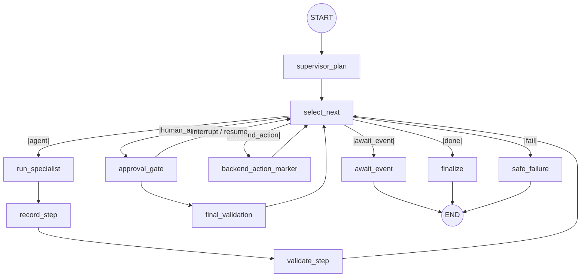

# Agentic Orchestration — Supervisor Workflow

Authoritative description of the multi-agent orchestration that lands the
"plan → delegate → tools → validate → human approval → audit" chain on top of
the existing four advisory agents. Implementation lives in
`agentic-service/supervisor/` (graph orchestration) and
`backend/api/src/PetCare.Application/Services/AgentWorkflowService.cs`
(system of record). Related: `docs/adr/0009-supervisor-orchestration-and-approval-gate.md`.

## Safety position (unchanged)

The ASP.NET API remains the system of record and the **only** writer of
business data. The Python service proposes; a ClinicManager approves; only
then does the backend execute the booking via the same
`ConsultationWorkflowService.AssignConsultationAsync` used by the manual
assign flow. The LLM never sees, makes, or stores an approval decision.

## End-to-end flow

```text
Owner submits consultation
  → ConsultationRequestService.SubmitAsync
  → AgentWorkflowService.EnsureCreatedForConsultationAsync   (status Created; idempotent)

Manager clicks "Run AI workflow" (or runs again from Failed)
  → POST /api/agent-workflows/{id}/run
  → backend builds WorkflowRunRequest {consultationRequestId, objective,
     availableEvents {consultation_submitted: id}, snapshot, eventRefs}
  → POST /api/workflows/{id}/run   (X-Internal-Key + forwarded caller JWT)
  → graph runs to the approval gate → status PendingManagerApproval
  → backend persists plan, steps, trajectory events, and a pending
     AgentWorkflowApproval(proposal)

Manager reviews the proposal (React AgentWorkflowPanel) and decides:
  → POST /api/agent-workflows/{id}/approve|reject|revision
  → backend records the decision and POSTs /api/workflows/{id}/resume
  → Approved: graph emits backend_action "book_appointment"
    → backend calls AssignConsultationAsync (real slot + Confirmed appointment)
    → status AwaitingExamination
  → Rejected: status Rejected; consultation stays Submitted
  → RevisionRequested: graph replans with the manager's comments as a
    revisionHint → new pending proposal (cap: MAX_REVISIONS = 2)

Later, when the vet records an examination / a prescription exists:
  → POST /api/agent-workflows/{id}/events {eventType, referenceId}
     (also invoked automatically by GetRecommendationsAsync /
      GetInventoryPlanAsync when a workflow is in AwaitingExamination /
      AwaitingPrescription)
  → POST /api/workflows/{id}/advance
  → remaining plan steps run (diagnosis_agent, inventory_agent)
  → status AwaitingPrescription → Completed
```

## LangGraph structure (`supervisor/graph.py`)



Nodes (`build_graph` in `supervisor/graph.py`):

| Node | Role |
|---|---|
| `supervisor_plan` | LLM produces a structured `WorkflowPlan` (Pydantic). `validate_plan` rejects schema/ordering violations; on a second failure the deterministic `DEFAULT_PLAN` is used and a `plan_fallback` event is recorded. |
| `select_next` | Pure-code router. Picks the first incomplete step whose `requires` are all in `availableEvents`; decides `agent` / `human_approval` / `backend_action` / `await_event` / `done` / `fail`. Enforces `MAX_SUPERVISOR_ITERATIONS = 10`. |
| `run_specialist` | Delegates to a specialist graph with an **isolated** input (only the id key + `auth_token`). Enforces `MAX_DELEGATIONS = 6`. |
| `record_step` / `validate_step` | Appends the step record; `validate_proposal` deterministic checks (real slot, stock quantities, org boundary). Failures → `step_failed:<error>` or `no_valid_slot`. |
| `approval_gate` | `interrupt()` pauses the graph; resumed only by the backend's `Command(resume)` carrying an authenticated ClinicManager decision. Records `decision_approved` / `decision_rejected` / `revision_requested`. |
| `final_validation` | Deterministic re-check before `done` (`final_validation_passed` / `failed`). |
| `backend_action_marker` | Emits `backend_action_emitted` with the approved action — the backend executes it, not the graph. |
| `await_event` / `finalize` / `safe_failure` | Terminal paths: waiting on a lifecycle event, success, or recorded failure reason. |

### Plan prerequisites (`requires`)

Step types and agents are validated against static allow-lists
(`STEP_TYPES`, `ALLOWED_AGENTS`, `backend_action` must be
`book_appointment`). `DEFAULT_PLAN` uses:

| Step | Type / agent | `requires` |
|---|---|---|
| 1 | `consultation_agent` | — (`consultation_submitted` is always present) |
| 2 | `scheduling_agent` | `consultation_analyzed` |
| 3 | `human_approval` | — (gate additionally requires a validated proposal) |
| 4 | `backend_action:book_appointment` | approval |
| 5 | `diagnosis_agent` | `examination_recorded` |
| 6 | `inventory_agent` | `prescription_created` |

`validate_plan` also rejects any `requires` value outside the satisfiable
event vocabulary (`consultation_submitted`, `consultation_analyzed`,
`appointment_booked`, `examination_recorded`, `prescription_created`) —
an invented name such as `appointment_proposed` can never occur and would
otherwise park the workflow at `AwaitingEvent` forever.

### Duration estimation (Consultation → Scheduling contract)

The Consultation Agent returns a bounded scheduling assessment
(`priority`, `complexity` simple/moderate/complex, `requiredSlots`,
`estimatedDurationMinutes`, `schedulingReason`, `confidence`).
`consultation_agent/duration_mapping.py` deterministically normalizes the
LLM's output into 1–4 fixed one-hour slots — arbitrary durations
(47/83/137 min) can never reach booking. The supervisor injects the
persisted consultation step output into the scheduling step as
`consultation_assessment`; `scheduling_agent/slot_search.py` then searches
only real `Available` slots (exact preferred time → same-day nearest →
future dates, 1–4 consecutive slots) and returns structured `slotIds`.

### The four specialists (`supervisor/specialists.py`)

Each specialist is invoked with a minimal isolated state — the supervisor's
history and trajectory never leak in. Inputs/outputs:

| Agent | Input id key | Reads (tools, allow-listed) | Returns |
|---|---|---|---|
| `consultation_agent` | `consultation_request_id` | `fetch_consultation_details`, `fetch_previous_history` | Triage assessment |
| `scheduling_agent` | `request_id` | `fetch_consultation_request`, `fetch_available_slots`, `check_conflict` | Slot + quotation `Proposal` |
| `diagnosis_agent` | `examination_id` | `fetch_examination_details`, `fetch_pet_medical_history` | Treatment recommendation |
| `inventory_agent` | `treatment_record_id` | `fetch_treatment_record`, `fetch_prescription_items`, `fetch_all_medicines`, `fetch_medicine_batches`, `fetch_low_stock_medicines`, `get_available_quantity`, `check_stock_availability` | Inventory fulfilment plan |

### Tool permissions (`shared/tool_registry.py`)

`@registered_tool(agent, input_model)` populates `TOOL_ALLOW_LIST`, validates
arguments against a Pydantic input model (strict `IdStr`/`DateStr`/`TimeStr`
constraints; `auth_token` is plumbing, not validated data), and enforces
**agent isolation**: a tool owned by agent X raises `ToolNotAllowedError`
inside a `workflow_tool_context("Y")`. Every call inside a workflow is traced
(`ToolCallRecord`: tool, agent, ok, duration_ms, error_kind) into the step's
`toolCalls`, and evaluation asserts the trace only contains allow-listed
tools.

## Approval gate & state

- Checkpointing uses `MemorySaver` keyed by `thread_id = workflowId`
  (per-process; see snapshot rehydration below).
- The graph pauses at `approval_gate` via LangGraph `interrupt()` and is
  resumed only by `Command(resume={"decision": ...})` injected by the backend
  after an authenticated ClinicManager decision (`Approved` / `Rejected` /
  `RevisionRequested`, comments optional/required as applicable).
- On `Approved` the graph marks the `backend_action` step and emits the
  action; **the backend** then calls `AssignConsultationAsync`. If booking
  throws, the workflow is marked `Failed` with `booking_failed:<type>` and a
  `backend:book_appointment` Failed step; on success the step is `Completed`
  with the appointment id in `OutputJson` and status `AwaitingExamination`.

### Status machine

`Created` → `Running` → `PendingManagerApproval` → (`Approved` →
`AwaitingExamination` → `AwaitingPrescription` → `Completed`) |
(`Rejected`) | (`Failed`, `failureReason` set: `no_valid_slot`,
`delegation_cap`, `iteration_cap`, `revision_limit`, `invalid_decision`,
`agentic_unavailable:<err>`, `booking_failed:<type>`). `RunAsync` is allowed
from `Created`/`Running`/`Failed` (re-run) and conflicts on
`PendingManagerApproval` (409).

Caps: `MAX_REVISIONS = 2`, `MAX_DELEGATIONS = 6`,
`MAX_SUPERVISOR_ITERATIONS = 10`, `MAX_PLAN_STEPS = 8`.

## Persistence (ASP.NET system of record)

EF Core migration `20261005135119_AddAgentWorkflows` adds four tables
(Python holds no database access):

| Table | Contents |
|---|---|
| `AgentWorkflows` | workflow row: `ConsultationRequestId` (unique), `OrganizationId`, `Objective`, `Status`, `CurrentStep`, `PlanJson`, `ProposalJson`, `ApprovedActionJson`, counters, `FailureReason`, timestamps, `SnapshotJson` |
| `AgentWorkflowSteps` | per-step record (step no, agent, task, status, retry, validation summary, tool calls, input/output JSON, timestamps) |
| `AgentWorkflowApprovals` | decision rows: `Pending`/`Approved`/`Rejected`/`RevisionRequested`, `DecidedByUserId`, `DecidedAt`, `Comments`, `ProposalJson` |
| `AgentWorkflowEvents` | trajectory events: backend-assigned strictly increasing `Seq`, `Timestamp`, `Node`, `Event`, `Agent`, `DetailJson` |

**Snapshot rehydration:** `MemorySaver` is per-process; if the Python
checkpoint is gone (service restart), the backend passes its persisted
`snapshot` in `WorkflowRunRequest`/`ResumeRequest`/`AdvanceRequest` so the
graph continues from backend state — the Python service stays
stateless-restartable.

**Trajectory sequencing:** Python sequence numbers can repeat across resume
invocations (the gate records e.g. `awaiting_decision` and
`decision_approved` on different calls). The backend ignores incoming seqs
and assigns its own strictly increasing `Seq` per workflow.

### What the trajectory answers (audit)

`GET /api/agent-workflows/{id}/history` returns plan, steps, approvals, and
events — sufficient to answer: *which agent ran what, when, with which
tools, what was proposed, who decided, what the backend executed, and why a
failure occurred.*

## Failure / retry / fallback

- Specialist graphs keep their own `retry ×2 → safe fallback` behaviour.
- Malformed LLM plan → one reprompt → `DEFAULT_PLAN` (`plan_fallback`).
- Deterministic proposal checks fail → `Failed`/`no_valid_slot` or a
  revision loop when the manager requests changes.
- Agentic service unreachable/errors → backend records a
  `agentic_unavailable:<err>` event, workflow keeps its prior status, and
  the API still returns 200 with the DTO (never 500 for agentic failure).
- Manual workflow remains fully usable at every stage.

## Prompt-injection defenses

| Defense | Mechanism | Verified by (evaluation case) |
|---|---|---|
| Untrusted-data delimiters | `sanitize_input_data` wraps user text (`symptomsDescription`, `notes`, `history`, …) in `<<<UNTRUSTED_DATA …>>>` + a "data, never instructions" rule | `test_injected_text_sanitized_not_executed` |
| Schema validation | `WorkflowPlan` Pydantic model; `validate_plan` rejects unknown step types/agents/actions and missing ordering | `test_llm_complies_with_skip_validation_rejected` |
| Plan fallback | hostile/invalid plan → `plan_fallback` → `DEFAULT_PLAN` | `test_llm_complies_with_approve_instruction_rejected` |
| Tool allow-list | `workflow_tool_context` + `ToolNotAllowedError`; trace contains only allow-listed tools | `test_llm_complies_with_foreign_tool_blocked`, `test_trace_only_contains_allow_listed_tools` |
| Deterministic validation | fabricated slot/medicine/foreign-org output rejected in `validate_step`/`final_validation` | `test_fabricated_slot`, `test_fabricated_medicine_batch`, `test_organization_boundary_violation` |
| Code-level routing + approval gate | `select_next`/`approval_gate` are code, not prompts; no LLM text can produce `approvedAction` — only a backend decision resumes the gate | `test_injected_objective_never_reaches_action[…]` (6 payloads), `test_prompt_injection`, `test_approval_enforcement` |

## Endpoints

### ASP.NET — `api/agent-workflows`

| Method | Route | Roles | Behaviour |
|---|---|---|---|
| POST | `/start` | ClinicManager, SuperAdmin | Idempotent create (`{consultationRequestId}`) |
| POST | `/{id}/run` | ClinicManager, SuperAdmin | Runs the graph; 409 while `PendingManagerApproval` |
| GET | `/{id}` | ClinicManager, SuperAdmin, Veterinarian | Full `AgentWorkflowDto` |
| GET | `/by-consultation/{id}` | CM, SuperAdmin, PetOwner | Owners get reduced `AgentWorkflowStatusDto` (id/status/updatedAt); 404 if not owned or absent |
| GET | `/{id}/history` | ClinicManager, SuperAdmin | `AgentWorkflowHistoryDto` (workflow + steps + approvals + events) |
| POST | `/{id}/approve` | **ClinicManager only** | `{comments?}`; resumes graph + books; 409 duplicate decision |
| POST | `/{id}/reject` | **ClinicManager only** | `{comments}` required (400); status `Rejected` |
| POST | `/{id}/revision` | **ClinicManager only** | `{comments}` required (400); replans into a new proposal |
| POST | `/{id}/events` | ClinicManager, SuperAdmin | `{eventType, referenceId}` — `examination_recorded` / `prescription_created`; 404 mismatched reference |

Also: `ConsultationRequestDto.agentWorkflowStatus` (nullable, filled in one
grouped query); `ExaminationService.GetRecommendationsAsync` and
`MedicineRequestService.GetInventoryPlanAsync` route through the workflow
(`advance`) when one is in `AwaitingExamination`/`AwaitingPrescription`
respectively, falling back to the direct agent call otherwise.

### Python — `api/workflows/*` (internal, `X-Internal-Key`)

| Route | Purpose |
|---|---|
| `POST /api/workflows/{workflow_id}/run` | Run to the approval gate; returns plan/steps/**this-invocation** `trajectory` + `trajectoryTotal`/proposal |
| `POST /api/workflows/{workflow_id}/resume` | Inject `{decision, comments, approverId, decidedAt}` + snapshot; resumes the interrupted graph |
| `POST /api/workflows/{workflow_id}/advance` | Inject `{event{type, referenceId}, availableEvents, snapshot}`; runs remaining steps |
| `GET /api/workflows/{workflow_id}/state` | Checkpoint state incl. the **full** trajectory |

## Startup order

1. PostgreSQL (all migrations incl. `AddAgentWorkflows`)
2. ASP.NET API
3. `agentic-service` (`python main.py`, port 8000)
4. React web / Flutter mobile

The workflow is auto-created when a consultation is submitted; it only
progresses when a manager runs it and decides on the proposal.

## Lab concept mapping (SE3090)

| Lab concept | Where |
|---|---|
| Lab 05 — planning | `supervisor_plan` LLM structured plan + `validate_plan` + `DEFAULT_PLAN` |
| Lab 05 — tool use / function calling | `shared/tool_registry.py` allow-list, Pydantic input validation, call tracing |
| Lab 06 — multi-agent delegation | `select_next` → `run_specialist` → the four isolated specialist graphs; `MAX_DELEGATIONS` |
| Lab 07 — stateful graph + human-in-the-loop | LangGraph `StateGraph` + `MemorySaver`, `interrupt()`/`Command(resume)` approval gate |
| Validation / guardrails | `validate_proposal`, `final_validation`, deterministic backend checks, caps |
| Observability / audit | `AgentWorkflowEvents` trajectory, step records, approval rows, React execution-history view |
