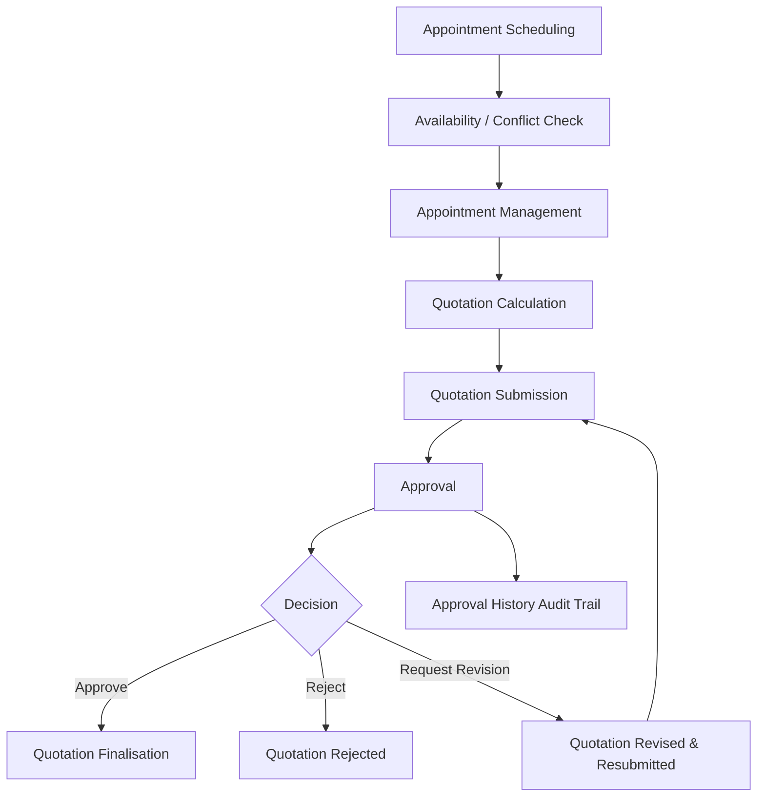
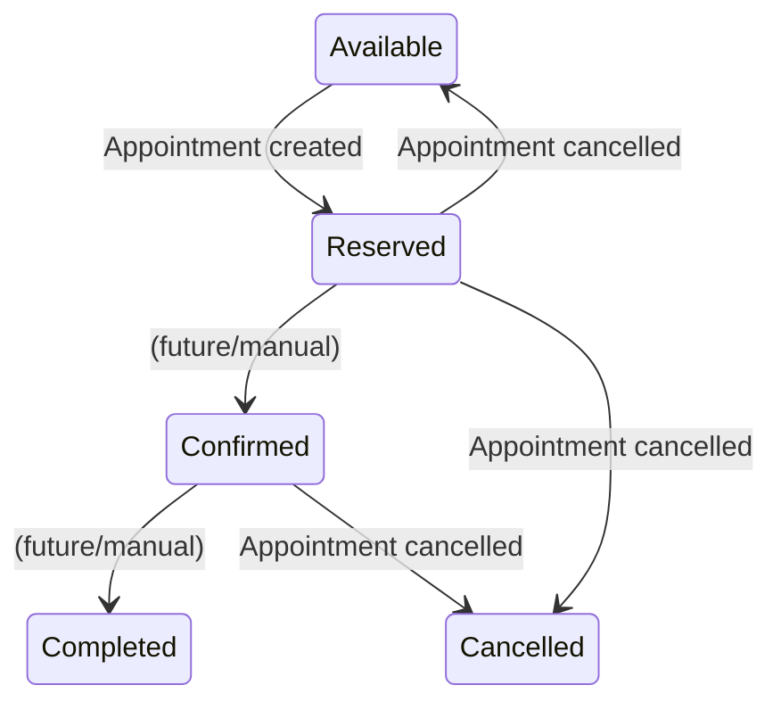
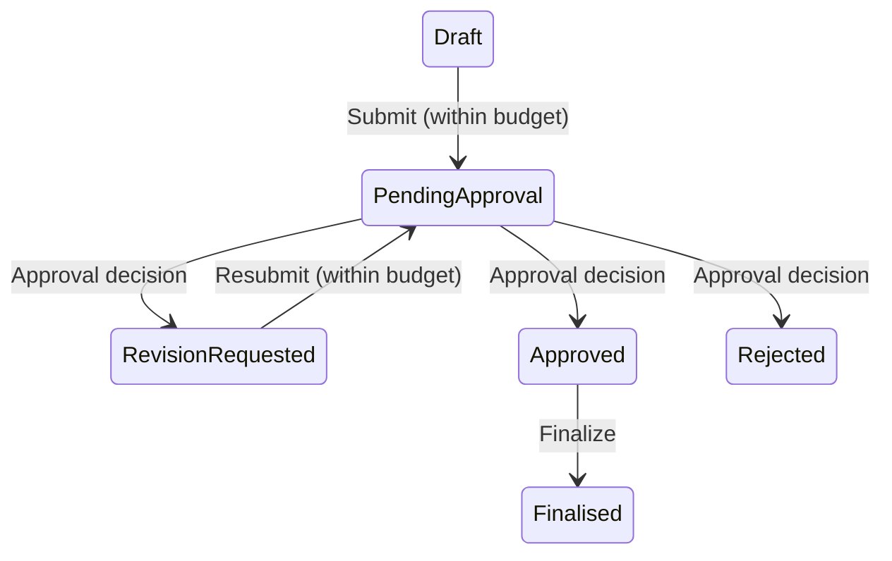
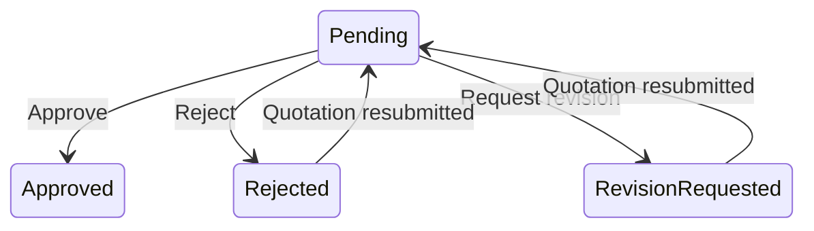

# Scheduling, Billing & Approval Workflow

This document describes the complete business workflow of the Scheduling, Billing & Approval Management component. Every state, rule, and transition below is verified against the actual source code in `PetCare.Application/Services/`, `PetCare.Domain/Enums/`, and `PetCare.Api/Controllers/`.

---

## 1. Business objective

Enable a veterinary clinic to schedule conflict-free appointments, produce budget-compliant quotations for those appointments, and require a Clinic Manager to approve, reject, or request revision on each quotation before it can be finalised — with a full audit trail of every decision.

---

## 2. Actors

The role names below are confirmed in `PetCare.Domain/Constants/Roles.cs`:

| Actor | Role constant | Capabilities |
|---|---|---|
| Clinic Manager | `Roles.ClinicManager` | All authenticated operations **plus** approve, reject, and request revision on pending quotations |
| Staff | `Roles.Staff` | All authenticated operations (scheduling, billing, viewing approvals). Cannot make approval decisions. |

Any authenticated user can list appointments, manage quotations, and view approvals. Only `ClinicManager` can execute approval decisions, enforced by `[Authorize(Roles = Roles.ClinicManager)]` on the three decision endpoints.

---

## 3. Overall flow



---

## 4. Scheduling workflow

### Viewing appointments

- `GET /api/appointments` returns all appointments.
- `GET /api/appointments/{id}` returns a single appointment or 404.

### Available slots

- `GET /api/appointments/available-slots?veterinarianId={guid}&date={date}` returns slots with status `Available`, optionally filtered by veterinarian and/or date.

### Conflict checking

- `POST /api/appointments/check-conflict` accepts `{VeterinarianId, ScheduledStart, ScheduledEnd, AppointmentId?}` and returns `true`/`false` without creating anything.
- The overlap rule (from `SchedulingService.CheckConflictAsync`):
  ```
  newStart < existingEnd && newEnd > existingStart
  ```
- Cancelled appointments are excluded defensively — they do not block a slot.

### Creating an appointment

`POST /api/appointments` runs an 8-step validation in `SchedulingService.CreateAppointmentAsync`:

1. Structural validation via `CreateAppointmentRequestValidator` (start < end, same-day, vet/slot IDs present).
2. Veterinarian exists (`NotFoundException` → 404 if not).
3. Veterinarian is active (`SchedulingConflictException` → 409 if not).
4. Appointment slot exists (`NotFoundException` → 404 if not).
5. Slot belongs to the specified veterinarian (`SchedulingConflictException` → 409 if not).
6. Requested time fits inside the slot's date/start/end bounds.
7. No conflicting non-cancelled appointment exists for the same veterinarian.
8. Create appointment with status `Reserved`, mark slot as `Reserved`, save in one transaction.

### Updating an appointment

`PUT /api/appointments/{id}` re-validates conflicts (excluding the appointment itself via `AppointmentId`) and updates date/start/end/notes.

### Cancelling an appointment

`DELETE /api/appointments/{id}` performs a **soft cancel**: sets `Appointment.Status` to `Cancelled` and frees the slot by setting `AppointmentSlot.Status` back to `Available`. The row is not deleted.

---

## 5. Billing / quotation workflow

### Quotation creation

`POST /api/quotations` creates a quotation for an appointment. Enforced rules (from `BillingService` and `QuotationValidator`):

- The appointment must exist.
- The 1:1 rule: an appointment can have at most one quotation (enforced by a unique index on `Quotation.AppointmentId`).
- `Subtotal` and `Total` are **always recomputed server-side** from the submitted line items — never trusted from client input.
- Each `QuotationItem.TotalPrice` is recomputed as `Quantity * UnitPrice`.
- New quotation status is `Draft`.

### Quotation items

Each line item has: `Category` (CHECK-constrained to `Consultation`, `Examination`, `Treatment`, `Medicine`, `Other`), `Description`, `Quantity` (> 0), `UnitPrice` (>= 0), and `TotalPrice` (= `Quantity * UnitPrice`, enforced by DB CHECK).

### Updating a quotation

`PUT /api/quotations/{id}` replaces the full line-item set and budget, then recomputes subtotal/total. Blocked for `Approved` and `Finalised` quotations via `EnsureEditable` (`BillingConflictException` → 409).

### Calculation

`POST /api/quotations/{id}/calculate` recomputes `Subtotal` and `Total` from the currently persisted items and reports whether `Total <= Budget` (the `IsWithinBudget` flag in the response).

### Submission

`POST /api/quotations/{id}/submit` transitions the quotation from `Draft` or `RevisionRequested` to `PendingApproval`. Rules:

- Recomputes total before checking budget.
- If `Total > Budget`, throws `BillingConflictException` → 409. The quotation cannot be submitted.
- On success, `Quotation.Status` becomes `PendingApproval`.

### Finalisation

`POST /api/quotations/{id}/finalize` transitions an `Approved` quotation to `Finalised`. Only `Approved` quotations can be finalised; any other status returns 409.

---

## 6. Approval workflow

### Pending approvals

`GET /api/approvals/pending` lists all approvals awaiting a Clinic Manager decision. Before returning, `ApprovalService.EnsureApprovalRecordsAreCurrentAsync` reconciles the Approval table against `Quotation.Status = PendingApproval`:

- If a `PendingApproval` quotation has no `Approval` row, one is created as `Pending`.
- If a quotation was previously rejected/revision-requested, edited, and resubmitted back to `PendingApproval`, the existing `Approval` row is reset to `Pending` (with `ReviewedBy`/`ReviewedAt`/`Comment` cleared) and a "resubmitted for approval" history row is appended.

### Approval detail

`GET /api/approvals/{id}` returns the approval with quotation context (`QuotationTotal`, `QuotationBudget`) so a reviewer can decide without a separate billing round trip. Returns 404 if not found.

### Approval decisions

All three decision endpoints require `[Authorize(Roles = Roles.ClinicManager)]`:

| Endpoint | Action | Required input | Quotation status after |
|---|---|---|---|
| `POST /api/approvals/{id}/approve` | Approve | `ReviewedBy` (required), `Comment` (optional) | `Approved` |
| `POST /api/approvals/{id}/reject` | Reject | `ReviewedBy` (required), `Reason` (required, non-empty) | `Rejected` |
| `POST /api/approvals/{id}/revision` | Request revision | `ReviewedBy` (required), `Reason` (required, non-empty) | `RevisionRequested` |

Each decision:
1. Validates the request body via the corresponding FluentValidation validator.
2. Loads the approval and checks it is still `Pending` (`ApprovalConflictException` → 409 if not).
3. Checks the linked quotation is still `PendingApproval` (`ApprovalConflictException` → 409 if not).
4. Updates `Approval.Status`, `ReviewedBy`, `ReviewedAt`, `Comment`.
5. Updates the linked `Quotation.Status` to match.
6. Appends an `ApprovalHistory` row with `PreviousStatus`, `NewStatus`, `ChangedBy`, `Reason`, `ChangedAt`.
7. Saves everything in one transaction.

### Approval history

`GET /api/approvals/{id}/history` returns the full chronological audit trail of status changes for an approval. Returns 404 if the approval does not exist.

---

## 7. State transitions

### AppointmentStatus / AppointmentSlotStatus



Confirmed values (from `AppointmentStatus` / `AppointmentSlotStatus` enums): `Available`, `Reserved`, `Confirmed`, `Completed`, `Cancelled`.

### QuotationStatus



Confirmed values (from `QuotationStatus` enum): `Draft`, `PendingApproval`, `Approved`, `Rejected`, `RevisionRequested`, `Finalised`.

### ApprovalStatus



Confirmed values (from `ApprovalStatus` enum): `Pending`, `Approved`, `Rejected`, `RevisionRequested`.

---

## 8. Validation and business rules

| Rule | Enforced by | Failure response |
|---|---|---|
| Appointment start < end, same day | `CreateAppointmentRequestValidator` | 400 |
| Veterinarian must exist and be active | `SchedulingService` | 404 / 409 |
| Slot must exist and belong to the veterinarian | `SchedulingService` | 404 / 409 |
| Requested time must fit inside slot bounds | `SchedulingService` | 409 |
| No overlapping non-cancelled appointment | `SchedulingService.CheckConflictAsync` | 409 |
| 1:1 quotation per appointment | `QuotationValidator` + unique DB index | 400 / 409 |
| Quotation items: Quantity > 0, UnitPrice >= 0 | `QuotationValidator` + DB CHECK | 400 |
| Category in allowed set | `QuotationValidator` + DB CHECK | 400 |
| TotalPrice = Quantity × UnitPrice | `BillingService` + DB CHECK | 400 |
| Budget >= 0 | `QuotationValidator` + DB CHECK | 400 |
| Only Draft/RevisionRequested can be submitted | `BillingService` | 409 |
| Total must not exceed Budget on submission | `BillingService` | 409 |
| Only Approved can be finalised | `BillingService` | 409 |
| Approved/Finalised cannot be edited | `BillingService.EnsureEditable` | 409 |
| Only Pending approvals can be reviewed | `ApprovalService.GetReviewableApprovalAsync` | 409 |
| Quotation must be PendingApproval to review | `ApprovalService.GetReviewableApprovalAsync` | 409 |
| Reject/Revision require a non-empty Reason | `ApprovalValidator` + DB CHECK | 400 |
| ReviewedBy required when a decision is made | `ApprovalValidator` + DB CHECK | 400 |

---

## 9. Error handling

`ExceptionHandlingMiddleware` in `PetCare.Api` maps Application-layer exceptions to HTTP status codes using RFC 7807 Problem Details:

| Exception | HTTP status | Title |
|---|---|---|
| `NotFoundException` | 404 | The requested resource was not found. |
| `SchedulingConflictException` | 409 | The request conflicts with an existing scheduling business rule. |
| `BillingConflictException` | 409 | The request conflicts with an existing billing business rule. |
| `ApprovalConflictException` | 409 | The request conflicts with an existing approval business rule. |
| `InvalidCredentialsException` | 401 | Invalid email or password. |
| `ValidationException` (FluentValidation) | 400 | One or more validation errors occurred. (includes field-level `errors` dictionary) |
| `DbUpdateException` on `IX_Appointments_AppointmentSlotId` | 409 | The selected appointment slot is already in use. |
| Any other exception | 500 | An unexpected error occurred. |

Validation responses are serialized using the runtime type (`problemDetails.GetType()`) so `ValidationProblemDetails.Errors` is included in the JSON body.

---

## 10. Human approval

The system requires a **human approval action** at the following point:

- A quotation that has been submitted (`PendingApproval`) **cannot** be finalised until a Clinic Manager explicitly approves, rejects, or requests revision via the dedicated approval endpoints.
- The approve/reject/revision endpoints are protected by `[Authorize(Roles = Roles.ClinicManager)]`, so only an authenticated user with the `ClinicManager` role can execute them.
- Every decision is recorded in `ApprovalHistories` with the reviewer's ID (`ChangedBy`), the previous and new status, the reason (for reject/revision), and a timestamp.

There is no automatic/auto-approval path in the current implementation.

---

## 11. Current limitations

The following are genuine limitations discovered from the implementation, not speculation:

- **DTO field gaps:** `AppointmentSlotResponse`, `QuotationResponse`, and `ApprovalResponse` do not include pet name, owner name, veterinarian name, or branch. The UIs display IDs or placeholders where these names would appear. No data is fabricated.
- **`ReviewedBy` is caller-supplied:** The approval decision endpoints accept `ReviewedBy` in the request body rather than deriving it from the JWT `sub` claim. The role check is enforced, but the reviewer identity is not automatically bound to the authenticated user.
- **No refresh-token flow:** The JWT has a fixed expiry (default 60 minutes). After expiry, the user must log in again.
- **`PetId` is not FK-constrained in this schema:** `Appointment.PetId` references the Pet entity owned by another module. The cross-module FK is expected to be added once the Pet table exists.
- **Android runtime verification pending:** No Android emulator or physical device was available, so Flutter runtime behaviour on Android has not been verified.
- **AI workflow is UI-only:** The React AI Workflows page exists but no agent, model, or orchestration backend is implemented.
