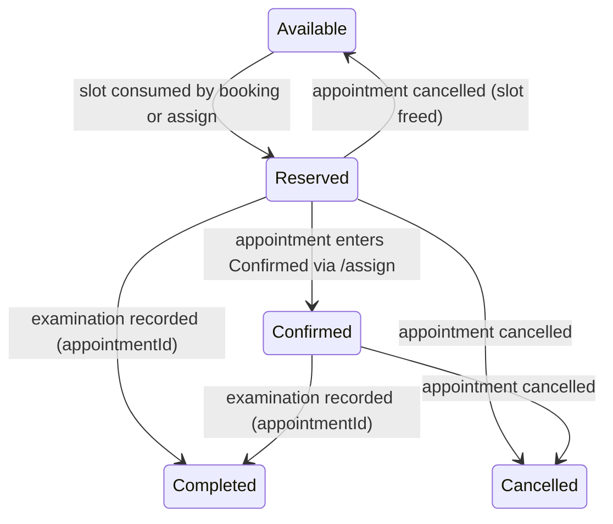
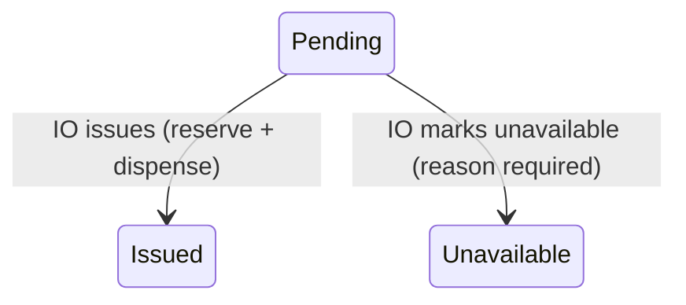
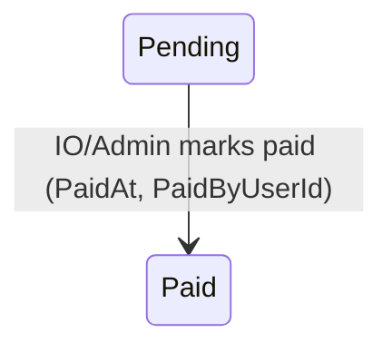
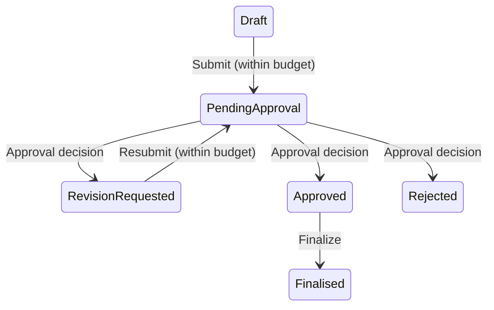
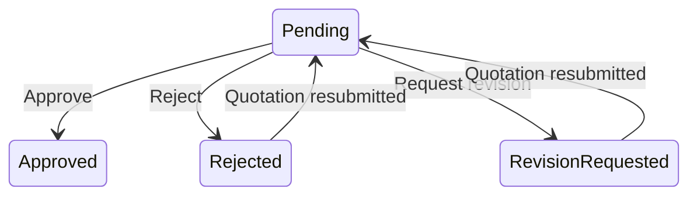

# Scheduling, Billing & Approval Workflow

This document describes the complete business workflow of the Scheduling, Billing & Approval Management component. Every state, rule, and transition below is verified against the actual source code in `PetCare.Application/Services/`, `PetCare.Domain/Enums/`, and `PetCare.Api/Controllers/`.

---

## 1. Business objective

Enable a veterinary clinic to run the full consultation lifecycle: a pet owner submits a consultation request, a Clinic Manager assigns a veterinarian (which books a conflict-free appointment), the veterinarian completes the visit through an examination → diagnosis → treatment → prescription chain, prescriptions flow to the inventory desk as medicine requests, the appointment's bill is generated automatically from the veterinarian charge and issued medicines, and payment is recorded by the inventory desk — with every status change audited.

A manual quotation + manager-approval capability (submit → approve/reject/revision → finalise, with a full approval audit trail) remains available alongside the automated billing path — see [§6](#6-approval-workflow-additional-capability).

---

## 2. Actors

The role names below are confirmed in `PetCare.Domain/Constants/Roles.cs`:

| Actor | Role constant | Capabilities in this workflow |
|---|---|---|
| Pet Owner | `Roles.PetOwner` | Registers pets, files and submits consultation requests, reads own appointments and own bills (`GET /api/appointments/mine`, `GET /api/quotations/mine`, `GET /api/quotations/{id}` ownership-checked) |
| Clinic Manager | `Roles.ClinicManager` | Views submitted requests, assigns a veterinarian (`POST /api/consultations/{id}/assign` — books the appointment), manages staff accounts, views veterinarian history (`/api/manager/veterinarians*`), views bills, approve/reject/request-revision on pending quotations |
| Veterinarian | `Roles.Veterinarian` | Own appointments only (`GET /api/appointments/mine`); records examinations (incl. `veterinarianCharge`), diagnoses, treatment records, prescriptions; files follow-up consultation requests (`POST /api/consultations/follow-up`) |
| Inventory Officer | `Roles.InventoryOfficer` | Medicine-request queue (`GET /api/prescriptions/requests`), issues or marks requests unavailable, records bill payment (`POST /api/quotations/{id}/mark-paid`) |
| Administrator | `Roles.SuperAdmin` | Elevated access where listed (assign, follow-up, issue/unavailable, mark-paid); platform user/organization management |

Assignment is a management action — the pet owner and the veterinarian never choose the assignee (`AssignRoles = ClinicManager + Administrator` on the endpoint). Issuing medicine and recording payment are inventory-desk actions — Veterinarian and ClinicManager callers get 403.

---

## 3. Overall flow

```mermaid
flowchart TD
    A[PetOwner: pick pet → select clinic (ClinicMap / orgs lookup)<br/>→ pick date (month availability) → pick 1-hour slot<br/>→ POST /api/consultations + /submit] --> B[ClinicManager assigns veterinarian<br/>POST /api/consultations/id/assign]
    B --> C[AppointmentSlot + Confirmed Appointment created<br/>request → AppointmentConfirmed]
    C --> D[Veterinarian completes visit<br/>POST /api/examinations appointmentId + veterinarianCharge]
    D --> E[Diagnosis → TreatmentRecord → Prescription<br/>each prescription = Pending medicine request]
    E --> F{InventoryOfficer processes request}
    F -->|POST /api/prescriptions/id/issue| G[Reserve + dispense atomically<br/>request → Issued]
    F -->|POST /api/prescriptions/id/unavailable| H[request → Unavailable<br/>reason required]
    G --> I[Bill auto-generated/refreshed on the appointment's Quotation<br/>Examination line = vet charge; Medicine line per Issued prescription<br/>Status=Finalised, PaymentStatus=Pending]
    H --> I
    I --> J[InventoryOfficer marks paid<br/>POST /api/quotations/id/mark-paid → PaymentStatus=Paid]
    J --> K[PetOwner views paid bill<br/>GET /api/quotations/mine]
    D -.->|vet files follow-up| L[POST /api/consultations/follow-up<br/>RequestType=FollowUp, Submitted] -.-> B
```

---

## 4. Scheduling workflow

### Viewing appointments

- `GET /api/appointments` returns all appointments in the caller's organization (Veterinarian, ClinicManager, Administrator).
- `GET /api/appointments/mine?status=&from=&to=&petId=` returns the caller-relevant set: a veterinarian sees only their own schedule, a pet owner sees appointments for their own pets, managers/admins see the organization list.
- `GET /api/appointments/{id}` returns a single appointment or 404; also allowed for the owning PetOwner (ownership checked in the action).

### Assignment-driven appointment creation (primary path)

- `POST /api/consultations/{id}/assign` (`ClinicManager` + `Administrator` only) accepts `{veterinarianId, date, startTime, endTime, notes?}` and, in one unit of work (`ConsultationWorkflowService.AssignConsultationAsync`):
  1. Validates the request and loads the consultation — must be `Submitted` or `Processing` (else 409).
  2. Loads the veterinarian (org-scoped; missing → 404, inactive → 409).
  3. Runs the same overlap rule as `CheckConflictAsync` — a conflicting non-cancelled appointment → 409.
  4. Creates an `AppointmentSlot` (status `Reserved`) and a `Confirmed` `Appointment` linked to the request (`Appointment.ConsultationRequestId`; `Appointment.Type` = `Initial` or `FollowUp` from `ConsultationRequest.RequestType`).
  5. Moves the request to `AppointmentConfirmed` and appends a `ConsultationStatusHistory` row.
- `POST /api/consultations/follow-up` (`Veterinarian` + `Administrator`) files a `RequestType=FollowUp` request (status `Submitted`) attributed to the attending veterinarian (`RequestedByVeterinarianId`, resolved from the JWT via `Veterinarian.UserId`). A manager confirms it through the same assign endpoint, producing a `FollowUp` appointment.

### Available slots

- `GET /api/appointments/available-slots?veterinarianId={guid}&date={date}` returns slots with status `Available`, optionally filtered by veterinarian and/or date.

### Conflict checking

- `POST /api/appointments/check-conflict` accepts `{VeterinarianId, ScheduledStart, ScheduledEnd, AppointmentId?}` and returns `true`/`false` without creating anything.
- The overlap rule (from `SchedulingService.CheckConflictAsync`):
  ```
  newStart < existingEnd && newEnd > existingStart
  ```
- Cancelled appointments are excluded defensively — they do not block a slot.

### Creating an appointment

`POST /api/appointments` runs an 8-step validation in `SchedulingService.CreateAppointmentAsync`:

1. Structural validation via `CreateAppointmentRequestValidator` (start < end, same-day, vet/slot IDs present).
2. Veterinarian exists (`NotFoundException` → 404 if not).
3. Veterinarian is active (`SchedulingConflictException` → 409 if not).
4. Appointment slot exists (`NotFoundException` → 404 if not).
5. Slot belongs to the specified veterinarian (`SchedulingConflictException` → 409 if not).
6. Requested time fits inside the slot's date/start/end bounds.
7. No conflicting non-cancelled appointment exists for the same veterinarian.
8. Create appointment with status `Reserved`, mark slot as `Reserved`, save in one transaction.

### Updating an appointment

`PUT /api/appointments/{id}` re-validates conflicts (excluding the appointment itself via `AppointmentId`) and updates date/start/end/notes.

### Cancelling an appointment

`DELETE /api/appointments/{id}` performs a **soft cancel**: sets `Appointment.Status` to `Cancelled` and frees the slot by setting `AppointmentSlot.Status` back to `Available`. The row is not deleted.

### Booking rules, clinic selection & availability (BookingRules / OrganizationLocation)

- **Fixed slots.** Operating hours are 09:00–18:00 as code constants (`BookingRules`) — nine fixed one-hour slots per day; `EndTime` = `StartTime + 1h` computed server-side (a client-supplied end time is ignored).
- **Request requirements.** Consultation create/update/follow-up require organization + date + an hour-aligned slot start within 09:00–17:00; past dates are rejected (400). Org-level slot capacity is checked at create and at submit — a full slot returns 409 "This appointment slot is no longer available. Please select another time." `ConsultationRequest.OrganizationId` (nullable, migration `20260927070805_BookingRules`) carries the clinic choice; staff consultation reads are org-scoped.
- **Assign protection.** Assign enforces the same 1-hour rule plus veterinarian overlap (409); a unique `(VeterinarianId, Date, StartTime)` index on `AppointmentSlot` guards concurrent assigns (SQLSTATE 23505 → 409).
- **Availability endpoints** (any authenticated): `GET /api/consultations/availability?organizationId&date[&veterinarianId]` → `{date,isPast,slots:[{start,end,available,availableVeterinarianIds}]}`; `GET /api/consultations/availability/month?organizationId&year&month` → `[{date,available,fullyBooked,isPast}]`. `GET /api/lookups/organizations` lists Active orgs `{id,name,city,address,latitude,longitude}` — the marker source for the owner map.
- **Clinic location.** `Organization.Latitude`/`Longitude` (nullable, migration `20260927081008_OrganizationLocation`) are captured optionally at organization registration (both-or-neither, range-validated: lat ±90, lng ±180). `GET /api/consultations/nearby-clinics?latitude&longitude&radiusKm=50` returns Active + `IsActive` orgs with coordinates — Haversine `distanceKm` (2dp), nearest first, 400 on invalid input. `GET /api/consultations/nearest-clinic` returns the single real nearest org or 404; the old hardcoded fake-clinic list was removed.
- **Maps usage.** Google Maps is used for map visualization, clinic location selection and directions. Bookable clinics are the active organizations registered in the PetCare system. Registration flow: enter address → "Select Location on Map" → search/zoom → pin the exact location → confirm — the system stores latitude/longitude automatically. Maps is strictly optional: if the map cannot load the picker shows a retryable "temporarily unavailable" notice (the location can be added later — registration continues), `ClinicMap` falls back to plain clinic cards, and geolocation denial is silent — registration and booking are never blocked. The optional key is configured via `frontend/web/.env` (see `.env.example` / `docs/setup/local-development.md`).
- **Web booking flow.** Pet → Select Clinic (one marker per org with coordinates; card = name/address/[Select Clinic]/[Get Directions] to `google.com/maps/dir/?api=1&destination=lat,lng`; optional "Use my location" → nearby-clinics distances) → month calendar (past and fully-booked days disabled, "Fully booked" label) → nine slot buttons (booked disabled) → symptoms/notes → `POST /consultations`. The manager assign dialog uses `availability?veterinarianId`; the vet follow-up form uses the same picker.

---

## 5. Billing workflow

### Automatic bill generation (primary path)

Billing reuses the `Quotation` entity as the bill — no separate invoice table exists.

1. **Visit completion** — `POST /api/examinations` with `appointmentId` + `veterinarianCharge` marks the appointment and its slot `Completed` and links the examination (`Examination.AppointmentId`, `ConsultationRequestId` inherited from the appointment). For a Veterinarian caller the attending profile is forced server-side via `Veterinarian.UserId` → the logged-in user (a client-supplied `VeterinarianId` is ignored).
2. **Medicine requests** — each `POST /api/prescriptions` accepts `quantity`, `frequency`, `instructions` and starts with `RequestStatus = Pending`, which is the medicine request to the inventory desk.
3. **Fulfilment** — the Inventory Officer works the queue (`GET /api/prescriptions/requests?status=`):
   - `POST /api/prescriptions/{id}/issue` (IO + Administrator only) reserves **and** dispenses atomically through the existing stock rules (`IInventoryService` — insufficient stock → 409, stock never goes negative); the request becomes `Issued` with the `ReservationId` link and `ProcessedByUserId`/`ProcessedAt` audit fields. If the dispense fails after reserving, the reservation is released.
   - `POST /api/prescriptions/{id}/unavailable` (IO + Administrator only) requires a `reason` → `Unavailable` with `UnavailableReason` recorded.
4. **Bill refresh** — after each processed request, `BillingService.GenerateOrRefreshBillForExaminationAsync` builds or refreshes the appointment's Quotation:
   - One `Examination`-category line = `Examination.VeterinarianCharge`.
   - One `Medicine` line per **Issued** prescription (unit price from `Medicine`); Pending/Unavailable requests are never billed.
   - Totals are recomputed server-side; `Status` is set to `Finalised`, `PaymentStatus` stays `Pending`.
   - A bill that is already `Paid` is never mutated again.
   - An examination with no `AppointmentId` produces no bill (standalone exams are not billable).
5. **Payment** — `POST /api/quotations/{id}/mark-paid` (**InventoryOfficer + Administrator only**; Veterinarian and ClinicManager → 403) transitions `PaymentStatus` Pending→Paid, stamping `PaidAt`/`PaidByUserId`. Only a `Finalised` quotation with a `Pending` payment can be marked paid (else 409).
6. **Owner visibility** — the PetOwner reads their bills via `GET /api/quotations/mine` and `GET /api/quotations/{id}` (ownership checked via the appointment's pet; others' bills → 404). `QuotationResponse` carries a derived `InvoiceNumber` (`INV-` + first 8 hex chars of the quotation `Id` — not a sequential counter) plus denormalised pet/owner/veterinarian/examination fields.
7. **Manager visibility** — `GET /api/quotations` (list + details, org-scoped) and `GET /api/manager/veterinarians/{id}/history` (bill totals, paid/pending counts per vet).

### Manual quotation workflow (additional capability)

The explicit quotation lifecycle below still exists and is used when a clinic drafts a quotation by hand instead of relying on the auto-generated bill.

#### Quotation creation

`POST /api/quotations` creates a quotation for an appointment. Enforced rules (from `BillingService` and `QuotationValidator`):

- The appointment must exist.
- The 1:1 rule: an appointment can have at most one quotation (enforced by a unique index on `Quotation.AppointmentId`).
- `Subtotal` and `Total` are **always recomputed server-side** from the submitted line items — never trusted from client input.
- Each `QuotationItem.TotalPrice` is recomputed as `Quantity * UnitPrice`.
- New quotation status is `Draft`.

### Quotation items

Each line item has: `Category` (CHECK-constrained to `Consultation`, `Examination`, `Treatment`, `Medicine`, `Other`), `Description`, `Quantity` (> 0), `UnitPrice` (>= 0), and `TotalPrice` (= `Quantity * UnitPrice`, enforced by DB CHECK).

### Updating a quotation

`PUT /api/quotations/{id}` replaces the full line-item set and budget, then recomputes subtotal/total. Blocked for `Approved` and `Finalised` quotations via `EnsureEditable` (`BillingConflictException` → 409).

### Calculation

`POST /api/quotations/{id}/calculate` recomputes `Subtotal` and `Total` from the currently persisted items and reports whether `Total <= Budget` (the `IsWithinBudget` flag in the response).

### Submission

`POST /api/quotations/{id}/submit` transitions the quotation from `Draft` or `RevisionRequested` to `PendingApproval`. Rules:

- Recomputes total before checking budget.
- If `Total > Budget`, throws `BillingConflictException` → 409. The quotation cannot be submitted.
- On success, `Quotation.Status` becomes `PendingApproval`.

### Finalisation

`POST /api/quotations/{id}/finalize` transitions an `Approved` quotation to `Finalised`. Only `Approved` quotations can be finalised; any other status returns 409.

---

## 6. Approval workflow (additional capability)

The approval workflow gates **manually drafted** quotations. Auto-generated bills from §5 are already `Finalised` — they do not pass through this flow.

### Pending approvals

`GET /api/approvals/pending` lists all approvals awaiting a Clinic Manager decision. Before returning, `ApprovalService.EnsureApprovalRecordsAreCurrentAsync` reconciles the Approval table against `Quotation.Status = PendingApproval`:

- If a `PendingApproval` quotation has no `Approval` row, one is created as `Pending`.
- If a quotation was previously rejected/revision-requested, edited, and resubmitted back to `PendingApproval`, the existing `Approval` row is reset to `Pending` (with `ReviewedBy`/`ReviewedAt`/`Comment` cleared) and a "resubmitted for approval" history row is appended.

### Approval detail

`GET /api/approvals/{id}` returns the approval with quotation context (`QuotationTotal`, `QuotationBudget`) so a reviewer can decide without a separate billing round trip. Returns 404 if not found.

### Approval decisions

All three decision endpoints require `[Authorize(Roles = Roles.ClinicManager)]`:

| Endpoint | Action | Required input | Quotation status after |
|---|---|---|---|
| `POST /api/approvals/{id}/approve` | Approve | `ReviewedBy` (required), `Comment` (optional) | `Approved` |
| `POST /api/approvals/{id}/reject` | Reject | `ReviewedBy` (required), `Reason` (required, non-empty) | `Rejected` |
| `POST /api/approvals/{id}/revision` | Request revision | `ReviewedBy` (required), `Reason` (required, non-empty) | `RevisionRequested` |

Each decision:
1. Validates the request body via the corresponding FluentValidation validator.
2. Loads the approval and checks it is still `Pending` (`ApprovalConflictException` → 409 if not).
3. Checks the linked quotation is still `PendingApproval` (`ApprovalConflictException` → 409 if not).
4. Updates `Approval.Status`, `ReviewedBy`, `ReviewedAt`, `Comment`.
5. Updates the linked `Quotation.Status` to match.
6. Appends an `ApprovalHistory` row with `PreviousStatus`, `NewStatus`, `ChangedBy`, `Reason`, `ChangedAt`.
7. Saves everything in one transaction.

### Approval history

`GET /api/approvals/{id}/history` returns the full chronological audit trail of status changes for an approval. Returns 404 if the approval does not exist.

---

## 7. State transitions

### AppointmentStatus / AppointmentSlotStatus


```mermaid
stateDiagram-v2
    Available --> Reserved: slot consumed by booking or assign
    Reserved --> Available: appointment cancelled (slot freed)
    Reserved --> Confirmed: appointment enters Confirmed via /assign
    Reserved --> Completed: examination recorded (appointmentId)
    Confirmed --> Completed: examination recorded (appointmentId)
    Reserved --> Cancelled: appointment cancelled
    Confirmed --> Cancelled: appointment cancelled
```

Confirmed values (from `AppointmentStatus` / `AppointmentSlotStatus` enums): `Available`, `Reserved`, `Confirmed`, `Completed`, `Cancelled`. In the current assign implementation the created `Appointment` lands directly in `Confirmed` while its `AppointmentSlot` is `Reserved`; both move to `Completed` when the examination is recorded. `Appointment.Type` is a separate enum: `Initial` | `FollowUp` (inherited from `ConsultationRequest.RequestType` at assignment).

### ConsultationRequest status (workflow-relevant)

`Submitted`/`Processing` → `AppointmentConfirmed` (manager assigns a vet). `RequestType` ∈ `Initial` | `FollowUp` (DB CHECK constraint); follow-ups are filed by the veterinarian via `POST /api/consultations/follow-up` and carry `RequestedByVeterinarianId`.

### MedicineRequestStatus (Prescription.RequestStatus)


```mermaid
stateDiagram-v2
    Pending --> Issued: IO issues (reserve + dispense)
    Pending --> Unavailable: IO marks unavailable (reason required)
```

Confirmed values (from `MedicineRequestStatus` enum): `Pending`, `Issued`, `Unavailable`. `Issued` records `ReservationId`, `ProcessedByUserId`, `ProcessedAt`; `Unavailable` records `UnavailableReason`, `ProcessedByUserId`, `ProcessedAt`.

### PaymentStatus (Quotation.PaymentStatus)


```mermaid
stateDiagram-v2
    Pending --> Paid: IO/Admin marks paid (PaidAt, PaidByUserId)
```

Confirmed values (from `PaymentStatus` enum): `Pending`, `Paid`. A `Paid` bill is a financial record and is never mutated by subsequent bill refreshes.

### QuotationStatus


```mermaid
stateDiagram-v2
    Draft --> PendingApproval: Submit (within budget)
    RevisionRequested --> PendingApproval: Resubmit (within budget)
    PendingApproval --> Approved: Approval decision
    PendingApproval --> Rejected: Approval decision
    PendingApproval --> RevisionRequested: Approval decision
    Approved --> Finalised: Finalize
```

Confirmed values (from `QuotationStatus` enum): `Draft`, `PendingApproval`, `Approved`, `Rejected`, `RevisionRequested`, `Finalised`.

### ApprovalStatus


```mermaid
stateDiagram-v2
    Pending --> Approved: Approve
    Pending --> Rejected: Reject
    Pending --> RevisionRequested: Request revision
    RevisionRequested --> Pending: Quotation resubmitted
    Rejected --> Pending: Quotation resubmitted
```

Confirmed values (from `ApprovalStatus` enum): `Pending`, `Approved`, `Rejected`, `RevisionRequested`.

---

## 8. Validation and business rules

| Rule | Enforced by | Failure response |
|---|---|---|
| Appointment start < end, same day | `CreateAppointmentRequestValidator` | 400 |
| Veterinarian must exist and be active | `SchedulingService` | 404 / 409 |
| Slot must exist and belong to the veterinarian | `SchedulingService` | 404 / 409 |
| Requested time must fit inside slot bounds | `SchedulingService` | 409 |
| No overlapping non-cancelled appointment | `SchedulingService.CheckConflictAsync` | 409 |
| 1:1 quotation per appointment | `QuotationValidator` + unique DB index | 400 / 409 |
| Quotation items: Quantity > 0, UnitPrice >= 0 | `QuotationValidator` + DB CHECK | 400 |
| Category in allowed set | `QuotationValidator` + DB CHECK | 400 |
| TotalPrice = Quantity × UnitPrice | `BillingService` + DB CHECK | 400 |
| Budget >= 0 | `QuotationValidator` + DB CHECK | 400 |
| Only Draft/RevisionRequested can be submitted | `BillingService` | 409 |
| Total must not exceed Budget on submission | `BillingService` | 409 |
| Only Approved can be finalised | `BillingService` | 409 |
| Approved/Finalised cannot be edited | `BillingService.EnsureEditable` | 409 |
| Only Pending approvals can be reviewed | `ApprovalService.GetReviewableApprovalAsync` | 409 |
| Quotation must be PendingApproval to review | `ApprovalService.GetReviewableApprovalAsync` | 409 |
| Reject/Revision require a non-empty Reason | `ApprovalValidator` + DB CHECK | 400 |
| ReviewedBy required when a decision is made | `ApprovalValidator` + DB CHECK | 400 |
| Only Submitted/Processing requests can be assigned | `ConsultationWorkflowService` | 409 |
| Assigned vet must exist, be active, in-scope, conflict-free | `ConsultationWorkflowService` | 404 / 409 |
| Veterinarian callers examine under their own profile | `ExaminationService` via `Veterinarian.UserId` | 403 if unlinked |
| Appointment already examined / completed / cancelled | `ExaminationService.CreateAsync` | 409 |
| Appointment belongs to the attending veterinarian | `ExaminationService.CreateAsync` | 409 |
| Only Pending medicine requests can be processed | `MedicineRequestService` | 409 (`InventoryConflictException`) |
| Insufficient stock on issue | `IInventoryService` reserve rule | 409, never negative stock |
| Unavailable requires a non-empty reason | `MedicineRequestService` | 400 |
| Only Finalised + Pending-payment bills can be marked paid | `BillingService.MarkPaidAsync` | 409 |
| PetOwner reads only own appointments/bills | `IOwnerAccessService` in action | 404 |

---

## 9. Error handling

`ExceptionHandlingMiddleware` in `PetCare.Api` maps Application-layer exceptions to HTTP status codes using RFC 7807 Problem Details:

| Exception | HTTP status | Title |
|---|---|---|
| `NotFoundException` | 404 | The requested resource was not found. |
| `SchedulingConflictException` | 409 | The request conflicts with an existing scheduling business rule. |
| `BillingConflictException` | 409 | The request conflicts with an existing billing business rule. |
| `ApprovalConflictException` | 409 | The request conflicts with an existing approval business rule. |
| `InventoryConflictException` | 409 | The request conflicts with an existing inventory business rule. |
| `ForbiddenException` | 403 | Access is forbidden for the current identity. |
| `InvalidCredentialsException` | 401 | Invalid email or password. |
| `ValidationException` (FluentValidation) | 400 | One or more validation errors occurred. (includes field-level `errors` dictionary) |
| `DbUpdateException` on `IX_Appointments_AppointmentSlotId` | 409 | The selected appointment slot is already in use. |
| Any other exception | 500 | An unexpected error occurred. |

Validation responses are serialized using the runtime type (`problemDetails.GetType()`) so `ValidationProblemDetails.Errors` is included in the JSON body.

---

## 10. Human approval

The system requires **human decisions** at the following points:

- **Veterinarian assignment** — a submitted consultation request is never auto-assigned; a ClinicManager (or Administrator) explicitly chooses the veterinarian and time window via `POST /api/consultations/{id}/assign`. No AI or automation performs this step.
- **Medicine fulfilment** — a `Pending` medicine request is only resolved by an InventoryOfficer (or Administrator) issuing it or marking it unavailable; insufficient stock simply returns 409.
- **Payment** — a bill stays `PaymentStatus = Pending` until an InventoryOfficer (or Administrator) calls `POST /api/quotations/{id}/mark-paid`. Veterinarians and ClinicManagers get 403.
- **Manual quotation approval** — a submitted manual quotation (`PendingApproval`) **cannot** be finalised until a Clinic Manager explicitly approves, rejects, or requests revision via the dedicated approval endpoints (`[Authorize(Roles = Roles.ClinicManager)]`). Every decision is recorded in `ApprovalHistories` with the reviewer's ID (`ChangedBy`), the previous and new status, the reason (for reject/revision), and a timestamp. There is no automatic/auto-approval path.

---

## 11. Current limitations

The following are genuine limitations discovered from the implementation, not speculation:

- **No notification platform:** there is no notification entity or infrastructure — "notifications" are status-driven pending-item views (manager request queue, IO medicine-request queue, dashboards). Nothing is pushed in real time.
- **Seeded veterinarians cannot sign in:** the 3 `HasData` `Veterinarians` rows have no `UserId`, so they cannot be logged into; vets created via `POST /api/manager/users/veterinarians` get a linked `Veterinarian` row automatically.
- **`GET /api/manager/veterinarians` lists Active vets only.**
- **`InvoiceNumber` is derived** (`INV-` + first 8 hex chars of the quotation `Id`), not a sequential counter.
- **Bill requires an appointment-linked examination:** `GenerateOrRefreshBillForExaminationAsync` returns `null` for examinations with no `AppointmentId`.
- **`ReviewedBy` prefers the JWT identity:** `ApprovalService` resolves the reviewer from `ITenantContext.UserId` and only falls back to the request-body `ReviewedBy` when no tenant user id is available. The role check is always enforced.
- **Some DTO field gaps remain:** `AppointmentSlotResponse` and `ApprovalResponse` still lack pet/owner/veterinarian display names (UIs show IDs/placeholders); `AppointmentResponse` and `QuotationResponse` now carry denormalised pet/owner/veterinarian/examination fields.
- **No refresh-token flow:** The JWT has a fixed expiry (default 60 minutes). After expiry, the user must log in again.
- **Android runtime verification pending:** No Android emulator or physical device was available during the original verification, so Flutter runtime behaviour on Android was verified via `flutter analyze`/`flutter test` and manifest-merge checks rather than on-device.
- **AI is advisory only:** the `agentic-service` agents (consultation triage, diagnosis assist, scheduling plan, inventory plan) produce recommendations surfaced to staff — a manager may consult "AI Consultation Analysis"/"AI Scheduling Plan" before assigning, a vet may consult "AI Assist" before diagnosing, and an inventory officer may consult "AI Plan" before issuing. None of them performs an action: assignment, fulfilment, billing and payment remain the human-decision points listed above. On agent failure the endpoints return a safe `unavailable` fallback and the workflow continues manually.
