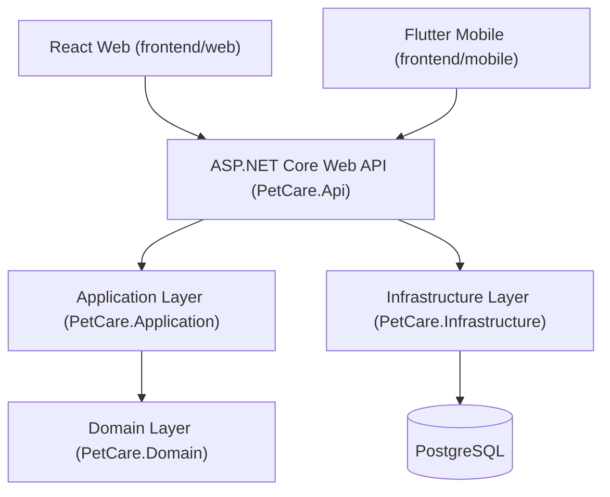

# Component Overview — Scheduling, Billing & Approval Management

This document describes the **Scheduling, Billing & Approval Management** component of the PetCare AI veterinary management system. It covers only functionality that is actually implemented in the current codebase on branch `Scheduling-Billing-Approval-Management`.

---

## 1. Purpose

This component is responsible for the end-to-end lifecycle of veterinary appointment scheduling, billing/quotation management, and the manager approval workflow that gates quotation finalisation. It owns the business rules for slot availability, veterinarian conflict detection, server-authoritative quotation calculation, budget compliance, and the approve/reject/request-revision decision flow with a full audit trail.

---

## 2. Scope

The following operations are implemented and confirmed by the code:

| Area | Operations |
|---|---|
| Appointment scheduling | List appointments, get appointment by id, create appointment, update appointment, cancel appointment (soft cancel) |
| Appointment slot availability | List available slots, filter by veterinarian and/or date |
| Conflict checking | Check whether a proposed time overlaps an existing non-cancelled appointment for the same veterinarian |
| Quotation/billing management | List quotations, get quotation by id, create quotation, update quotation (full item-set replace), calculate quotation |
| Quotation submission/finalization | Submit quotation for approval (budget-gated), finalize an approved quotation |
| Approval workflow | List pending approvals, get approval by id, approve, reject, request revision |
| Approval history | Retrieve the full chronological audit trail of status changes for an approval |

---

## 3. Architecture

The component follows a layered Clean Architecture / DDD-style structure. Both the React web client and the Flutter mobile client communicate with the same ASP.NET Core Web API, which is the single source of truth for all business rules. PostgreSQL is the persistence store, accessed through Entity Framework Core.

### Layer responsibilities

| Layer | Project | Responsibility |
|---|---|---|
| Presentation | `PetCare.Api` | HTTP controllers, DTO binding, Swagger/OpenAPI, CORS, JWT bearer authentication, role-based authorization, global exception middleware |
| Application | `PetCare.Application` | Use-case services (`SchedulingService`, `BillingService`, `ApprovalService`, `AuthService`), DTOs, FluentValidation validators, repository interfaces, unit-of-work interface |
| Domain | `PetCare.Domain` | Entities, enums, `AuditableEntity` base, `Roles` constants — no external dependencies |
| Infrastructure | `PetCare.Infrastructure` | EF Core `PetCareDbContext`, per-entity EF configurations, repository implementations, `JwtTokenGenerator`, `PasswordHasher`, migrations |
| Persistence | PostgreSQL | Relational storage with CHECK constraints, unique indexes, and seed reference data |

---

## 4. Backend structure

### Controllers (`PetCare.Api/Controllers/`)

| Controller | Route prefix | Endpoints |
|---|---|---|
| `AuthController` | `api/auth` | `POST /login` |
| `AppointmentsController` | `api/appointments` | `GET`, `GET/{id}`, `POST`, `PUT/{id}`, `DELETE/{id}`, `GET/available-slots`, `POST/check-conflict` |
| `QuotationsController` | `api/quotations` | `GET`, `GET/{id}`, `POST`, `PUT/{id}`, `POST/{id}/calculate`, `POST/{id}/submit`, `POST/{id}/finalize` |
| `ApprovalsController` | `api/approvals` | `GET/pending`, `GET/{id}`, `POST/{id}/approve`, `POST/{id}/reject`, `POST/{id}/revision`, `GET/{id}/history` |

Controllers are intentionally thin: they delegate all business logic to the Application-layer services and only handle HTTP concerns (routing, status codes, model binding).

### Application services (`PetCare.Application/Services/`)

| Service | Responsibility |
|---|---|
| `SchedulingService` | Appointment CRUD, slot availability, veterinarian overlap conflict detection |
| `BillingService` | Quotation CRUD, server-side subtotal/total computation, budget check on submission, status-transition rules |
| `ApprovalService` | Pending approval listing, approve/reject/request-revision, `ApprovalHistory` persistence, lazy approval-row provisioning |
| `AuthService` | Credential validation, JWT issuance, PetOwner/organization registration |
| `AdminService` | Platform administration — user/organization listing and status transitions, role catalog, system stats, and Administrator-only staff account creation (Veterinarian / InventoryOfficer into an Active organization, `MustChangePassword = true`, one-time temporary password) |

### Repositories (`PetCare.Infrastructure/Repositories/`)

`VeterinarianRepository`, `AppointmentSlotRepository`, `AppointmentRepository`, `QuotationRepository`, `ApprovalRepository`, `UserRepository`, `UnitOfWork` — all implementing interfaces declared in `PetCare.Application/Interfaces/`.

### DTOs (`PetCare.Application/DTOs/`)

Organized by sub-domain: `Auth/`, `Scheduling/`, `Billing/`, `Approval/`. Each request/response DTO maps to a specific endpoint contract.

### Validators (`PetCare.Application/Validators/`)

FluentValidation validators for `CreateAppointmentRequest`, `UpdateAppointmentRequest`, `CreateQuotationRequest`, `UpdateQuotationRequest`, `ApproveRequest`, `RejectRequest`, `RequestRevisionRequest`, `LoginRequest`.

### Domain entities (`PetCare.Domain/Entities/`)

See section 6 below.

---

## 5. Frontend structure

### React web (`frontend/web`)

| Area | Files |
|---|---|
| Auth | `features/auth/AuthContext.tsx`, `LoginPage.tsx`, `ProtectedRoute.tsx`; `services/authService.ts`; `utils/authStorage.ts` |
| Scheduling | `features/scheduling/SchedulingPage.tsx`; `services/schedulingService.ts` |
| Billing | `features/billing/BillingPage.tsx`; `services/billingService.ts` |
| Approval | `features/approvals/ApprovalPage.tsx`; `services/approvalService.ts` |
| AI workflows | `features/ai-workflows/AIWorkflowsPage.tsx` — **UI only, no agent implementation** |
| API boundary | `services/api.ts` — `ApiError` class, `apiRequest` helper, attaches `Authorization: Bearer` header |

Routing (`routes/AppRoutes.tsx`): `/login` is public; all other routes (`/`, `/scheduling`, `/billing`, `/approvals`, `/ai-workflows`, and placeholder pages) are wrapped in `ProtectedRoute`.

### Flutter mobile (`frontend/mobile`)

| Area | Files |
|---|---|
| Core | `core/network/api_client.dart`, `core/auth/auth_service.dart`, `core/auth/token_storage.dart`, `core/config/api_config.dart`, `core/routing/app_router.dart` |
| Auth | `features/auth/auth_provider.dart`, `features/auth/login_page.dart` |
| Scheduling | `features/scheduling/` — slots page, detail page, provider, service, model |
| Billing | `features/billing/` — quotations page, detail page, provider, service, model |
| Approval | `features/approval/` — approvals page, detail page, history page, provider, service, model |
| Home | `features/home/home_page.dart` |

State management uses the Provider pattern. `ApiClient` attaches the Bearer token and triggers `AuthProvider.logout` on 401 responses.

---

## 6. Main entities

All entities below are confirmed in `PetCare.Domain/Entities/` and mapped via EF Core configurations in `PetCare.Infrastructure/Configurations/`.

| Entity | Table | Key attributes | Relationships |
|---|---|---|---|
| `Veterinarian` | `Veterinarians` | Name, Specialisation, Branch, Active, OrganizationId | 1→many `AppointmentSlot`, 1→many `Appointment`; belongs to `Organization` |
| `AppointmentSlot` | `AppointmentSlots` | VeterinarianId, Date, StartTime, EndTime, Branch, Status | belongs to `Veterinarian`; 1:1 with `Appointment` |
| `Appointment` | `Appointments` | PetId (string), VeterinarianId, AppointmentSlotId, Date, StartTime, EndTime, Status, Notes | belongs to `Pet` (FK); belongs to `Veterinarian`; consumes 1 `AppointmentSlot`; 1:1 with `Quotation` |
| `Quotation` | `Quotations` | AppointmentId, Budget, Subtotal, Total, Status | 1:1 with `Appointment`; 1→many `QuotationItem`; 1:1 with `Approval` |
| `QuotationItem` | `QuotationItems` | QuotationId, Category, Description, Quantity, UnitPrice, TotalPrice | belongs to `Quotation` |
| `Approval` | `Approvals` | QuotationId, Status, ReviewedBy, ReviewedAt, Comment | 1:1 with `Quotation`; 1→many `ApprovalHistory` |
| `ApprovalHistory` | `ApprovalHistories` | ApprovalId, PreviousStatus, NewStatus, ChangedBy, Reason, ChangedAt | belongs to `Approval` |
| `User` | `Users` | Email, PasswordHash, Name, Role, Active, OrganizationId | belongs to `Organization`; 1:1 with `PetOwner`; referenced by `Approval.ReviewedBy` and `ApprovalHistory.ChangedBy` |

`PetId` on `Appointment` is a `string` FK → `Pets.Id` (corrected in the pre-migration work — it was a `Guid` placeholder with no constraint). `OrganizationId` on `Veterinarian` carries tenant ownership: `Appointment`, `AppointmentSlot`, `Quotation`, `Approval`, and `ApprovalHistory` derive their organization transitively through `Veterinarian`.

---

## 7. API responsibilities

| Endpoint group | Responsibility |
|---|---|
| `POST /api/auth/login` | Authenticates a user and returns a signed JWT + profile |
| `GET /api/appointments` | Lists all appointments |
| `GET /api/appointments/{id}` | Gets a single appointment |
| `POST /api/appointments` | Creates an appointment (validates vet/slot/conflict) |
| `PUT /api/appointments/{id}` | Updates an appointment's schedule/notes |
| `DELETE /api/appointments/{id}` | Cancels an appointment (soft cancel, frees slot) |
| `GET /api/appointments/available-slots` | Lists available slots, optionally filtered |
| `POST /api/appointments/check-conflict` | Checks overlap without creating anything |
| `GET /api/quotations` | Lists all quotations |
| `GET /api/quotations/{id}` | Gets a single quotation with items |
| `POST /api/quotations` | Creates a quotation (1:1 per appointment) |
| `PUT /api/quotations/{id}` | Replaces a quotation's items and budget |
| `POST /api/quotations/{id}/calculate` | Recomputes subtotal/total from current items |
| `POST /api/quotations/{id}/submit` | Submits for approval (budget-gated) |
| `POST /api/quotations/{id}/finalize` | Locks an approved quotation as finalised |
| `GET /api/approvals/pending` | Lists approvals awaiting a manager decision |
| `GET /api/approvals/{id}` | Gets a single approval with quotation context |
| `POST /api/approvals/{id}/approve` | Approves (Clinic Manager only) |
| `POST /api/approvals/{id}/reject` | Rejects with reason (Clinic Manager only) |
| `POST /api/approvals/{id}/revision` | Requests revision with reason (Clinic Manager only) |
| `GET /api/approvals/{id}/history` | Gets the full audit trail for an approval |

---

## 8. Security boundary

- **Authentication:** JWT bearer. `POST /api/auth/login` validates credentials via `IPasswordHasher` (PBKDF2) and issues a signed JWT through `IJwtTokenGenerator` (HMAC-SHA256).
- **Authorization:** Action-level `[Authorize(Roles = ...)]` using `Roles` constants: appointment reads → Veterinarian + ClinicManager + Administrator, appointment mutations → ClinicManager + Administrator; quotation reads → Veterinarian + ClinicManager + Administrator, quotation mutations → ClinicManager + Administrator; approval queue reads → Veterinarian + ClinicManager + Administrator; approval decisions → **ClinicManager only**.
- **Tenant scoping:** All scheduling/billing/approval repositories filter to the caller's `OrganizationId` via `ITenantContext` (SuperAdmin unscoped). Cross-organization entity ids resolve to 404.
- **Frontend protection (React):** `ProtectedRoute` redirects unauthenticated users to `/login`; `RoleRoute` + `features/auth/roleAccess.ts` gate routes per role (`/scheduling`, `/billing`, `/approvals` → Administrator + ClinicManager). Component-level `hasRole` checks gate action buttons.
- **Frontend protection (Flutter):** `AuthProvider` drives navigation between `LoginPage` and `HomePage` based on authentication state. `ApiClient` clears the token and triggers logout on 401.

---

## 9. Current implementation status

| Feature | Status |
|---|---|
| Scheduling backend (services, repositories, API, tests) | **Implemented** |
| Billing backend (services, repositories, API, tests) | **Implemented** |
| Approval backend (services, repositories, API, tests) | **Implemented** |
| Authentication (JWT, password hashing, login endpoint) | **Implemented** |
| Role-based authorization on approval decisions | **Implemented** |
| Action-level role authorization on all controllers | **Implemented** (pre-migration corrections, uncommitted) |
| Organization/tenant scoping on scheduling-billing-approval data | **Implemented** (pre-migration corrections, uncommitted) |
| `Appointment.PetId` → `Pets` FK (string, canonical) | **Implemented** (pre-migration corrections, uncommitted) |
| React web — Scheduling, Billing, Approval pages | **Implemented** |
| React web — Auth, ProtectedRoute, role-aware UI | **Implemented** |
| Flutter mobile — Scheduling, Billing, Approval screens | **Implemented** |
| Flutter mobile — Auth, Provider state management | **Implemented** |
| GitHub Actions backend CI workflow | **Implemented** (local verification; hosted run pending) |
| AI Workflows page (React) | **UI only** — no agent, model, or orchestration implementation |
| Agentic AI backend service | **Not implemented** |
| Android runtime verification | **Pending** — no emulator/device available |
| GitHub-hosted Actions run | **Pending** — workflow targets `main` push/PR events |

---

## 10. Integration

Both the React web application and the Flutter mobile application communicate exclusively with the same ASP.NET Core Web API. No client performs direct PostgreSQL access. The backend is authoritative for all business rules, persistence, and transactions. The API base URLs are:

- React: `VITE_API_BASE_URL` (defaults to `http://localhost:5080/api`)
- Flutter: `ApiConfig.baseUrl` (defaults to `http://10.0.2.2:5080/api` for the Android emulator loopback)

CORS is configured in `appsettings.Development.json` to allow `http://localhost:5173` (the Vite dev server origin). Production configuration has an empty allowed-origin list.
