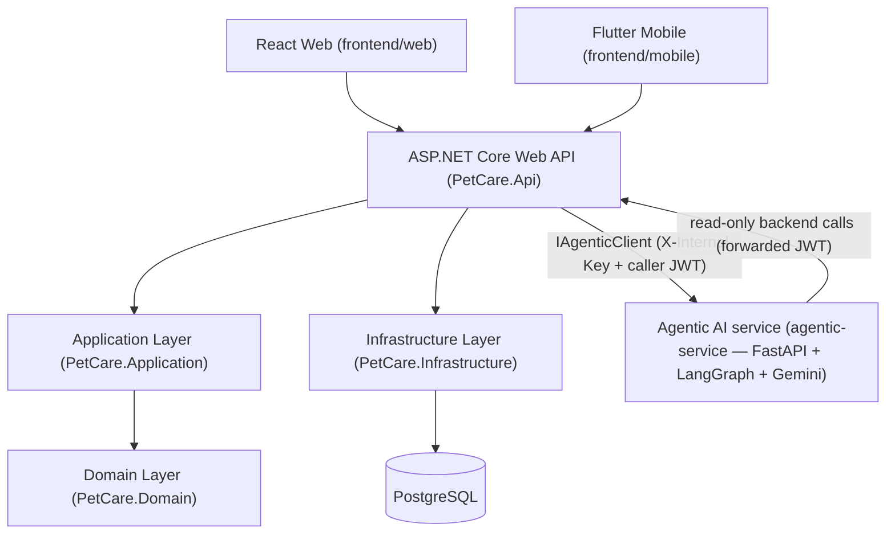

# Component Overview — Scheduling, Billing & Approval Management

This document describes the **Scheduling, Billing & Approval Management** component of the PetCare AI veterinary management system. It covers only functionality that is actually implemented in the current codebase (verified on `Merge_2`).

---

## 1. Purpose

This component is responsible for the end-to-end lifecycle of veterinary consultations: the pet owner's request, the manager's veterinarian assignment (which books the appointment), the examination → prescription → medicine-request chain, automatic bill generation on the quotation, and payment recording — plus the manual quotation/approval workflow that remains available for hand-drafted quotations. It owns the business rules for slot availability, veterinarian conflict detection, server-authoritative quotation/bill calculation, budget compliance, medicine-request fulfilment, payment state, and the approve/reject/request-revision decision flow with a full audit trail.

---

## 2. Scope

The following operations are implemented and confirmed by the code:

| Area | Operations |
|---|---|
| Appointment scheduling | List appointments, get appointment by id (owning PetOwner allowed), caller-scoped `/mine` view, create appointment, update appointment, cancel appointment (soft cancel) |
| Consultation-driven scheduling | Manager assigns a veterinarian to a submitted request (`/assign` → slot + Confirmed appointment, request → `AppointmentConfirmed`); veterinarian follow-up requests (`/follow-up`) |
| Appointment slot availability | List available slots, filter by veterinarian and/or date |
| Conflict checking | Check whether a proposed time overlaps an existing non-cancelled appointment for the same veterinarian |
| Quotation/billing management | List quotations, get quotation by id (owning PetOwner allowed), owner's `/mine` bills, create quotation, update quotation (full item-set replace), calculate quotation |
| Automatic billing | `GenerateOrRefreshBillForExaminationAsync` builds/refreshes the appointment's Quotation from the vet charge + Issued prescriptions (`Finalised`, `PaymentStatus`) |
| Payment | `POST /api/quotations/{id}/mark-paid` — InventoryOfficer/Administrator only |
| Medicine requests | Queue (`GET /api/prescriptions/requests`), issue (reserve + dispense atomically), mark unavailable — InventoryOfficer/Administrator only |
| Quotation submission/finalization | Submit quotation for approval (budget-gated), finalize an approved quotation |
| Approval workflow | List pending approvals, get approval by id, approve, reject, request revision |
| Approval history | Retrieve the full chronological audit trail of status changes for an approval |
| Manager veterinarian history | `GET /api/manager/veterinarians` + `/{id}/history` — per-vet appointment/examination/prescription/medicine-request/bill summaries |
| Booking rules & availability | Nine fixed 1-hour slots 09:00–18:00 (`BookingRules`); org/day slot availability and month calendar endpoints; slot-capacity check at request create + submit |
| Clinic locator | `GET /api/consultations/nearby-clinics` + `nearest-clinic` over real `Organization.Latitude`/`Longitude` (Haversine, Active orgs with coordinates); org registration accepts optional coordinates |
| Maps (React) | `LocationPickerMap` (org registration pin/manual fallback), `ClinicMap` (owner booking markers + directions + "Use my location", card fallback) via `lib/googleMaps.ts` script loader |

---

## 3. Architecture

The component follows a layered Clean Architecture / DDD-style structure. Both the React web client and the Flutter mobile client communicate with the same ASP.NET Core Web API, which is the single source of truth for all business rules. PostgreSQL is the persistence store, accessed through Entity Framework Core.

```mermaid
flowchart TD
    React["React Web (frontend/web)"]
    Flutter["Flutter Mobile (frontend/mobile)"]
    API["ASP.NET Core Web API (PetCare.Api)"]
    App["Application Layer (PetCare.Application)"]
    Domain["Domain Layer (PetCare.Domain)"]
    Infra["Infrastructure Layer (PetCare.Infrastructure)"]
    Agentic["Agentic AI service (agentic-service — FastAPI + LangGraph + Gemini)"]
    PG[("PostgreSQL")]

    React --> API
    Flutter --> API
    API --> App
    App --> Domain
    API --> Infra
    Infra --> PG
    API -- "IAgenticClient (X-Internal-Key + caller JWT)" --> Agentic
    Agentic -- "read-only backend calls (forwarded JWT)" --> API
```

### Layer responsibilities

| Layer | Project | Responsibility |
|---|---|---|
| Presentation | `PetCare.Api` | HTTP controllers, DTO binding, Swagger/OpenAPI, CORS, JWT bearer authentication, role-based authorization, global exception middleware |
| Application | `PetCare.Application` | Use-case services (`SchedulingService`, `BillingService`, `ApprovalService`, `AuthService`), DTOs, FluentValidation validators, repository interfaces, unit-of-work interface |
| Domain | `PetCare.Domain` | Entities, enums, `AuditableEntity` base, `Roles` constants — no external dependencies |
| Infrastructure | `PetCare.Infrastructure` | EF Core `PetCareDbContext`, per-entity EF configurations, repository implementations, `JwtTokenGenerator`, `PasswordHasher`, migrations |
| Persistence | PostgreSQL | Relational storage with CHECK constraints, unique indexes, and seed reference data |

---

## 4. Backend structure

### Controllers (`PetCare.Api/Controllers/`)

| Controller | Route prefix | Endpoints |
|---|---|---|
| `AuthController` | `api/auth` | `POST /login` |
| `AppointmentsController` | `api/appointments` | `GET`, `GET/mine`, `GET/{id}`, `POST`, `PUT/{id}`, `DELETE/{id}`, `GET/available-slots`, `POST/check-conflict` |
| `ConsultationRequestsController` | `api/consultations` | CRUD + `POST/{id}/assign` (CM/Admin), `POST/follow-up` (Vet/Admin), `POST/{id}/submit`, `PATCH/{id}/cancel`, `GET/{id}/history`, `GET/{id}/analysis` + `GET/{id}/scheduling-plan` (advisory AI, CM/Admin), `GET/availability`, `GET/availability/month`, `GET/nearby-clinics`, `GET/nearest-clinic` |
| `LookupsController` | `api/lookups` | `GET/pets`, `GET/medicines`, `GET/organizations` (Active orgs with address/coordinates — owner map source) |
| `QuotationsController` | `api/quotations` | `GET`, `GET/mine`, `GET/{id}`, `POST/{id}/mark-paid`, `POST`, `PUT/{id}`, `POST/{id}/calculate`, `POST/{id}/submit`, `POST/{id}/finalize` |
| `ApprovalsController` | `api/approvals` | `GET/pending`, `GET/{id}`, `POST/{id}/approve`, `POST/{id}/reject`, `POST/{id}/revision`, `GET/{id}/history` |
| `PrescriptionsController` | `api/prescriptions` | CRUD + `GET/requests`, `POST/{id}/issue`, `POST/{id}/unavailable`, `GET/treatment/{id}/inventory-plan` (advisory AI) (IO/Admin) |
| `ManagerController` | `api/manager` | `GET/veterinarians`, `GET/veterinarians/{id}/history`, `POST/users/veterinarians`, `POST/users/inventory-officers` (CM only) |

Controllers are intentionally thin: they delegate all business logic to the Application-layer services and only handle HTTP concerns (routing, status codes, model binding).

### Application services (`PetCare.Application/Services/`)

| Service | Responsibility |
|---|---|
| `SchedulingService` | Appointment CRUD, slot availability, veterinarian overlap conflict detection, caller-scoped `GetMyAppointmentsAsync` |
| `ConsultationWorkflowService` | `AssignConsultationAsync` (vet assignment → slot + Confirmed appointment + request status/history in one unit of work); `CreateFollowUpAsync` (vet-filed `RequestType=FollowUp` requests) |
| `BillingService` | Quotation CRUD, server-side subtotal/total computation, budget check on submission, status-transition rules, `GenerateOrRefreshBillForExaminationAsync` (auto-bill from vet charge + Issued prescriptions), `MarkPaidAsync`, `GetQuotationsForOwnerAsync` |
| `MedicineRequestService` | Inventory-officer medicine-request queue: `GetRequestsAsync`, `IssueAsync` (reserve + dispense via `IInventoryService`, failed dispense releases the reservation), `MarkUnavailableAsync` (reason required); each decision refreshes the bill |
| `CurrentVeterinarianResolver` | Resolves the caller's `Veterinarian` profile via `ITenantContext.UserId` → `Veterinarian.UserId` (`TryResolveAsync`/`ResolveRequiredAsync` — 403 when unlinked) |
| `ApprovalService` | Pending approval listing, approve/reject/request-revision, `ApprovalHistory` persistence, lazy approval-row provisioning |
| `AuthService` | Credential validation, JWT issuance, PetOwner/organization registration (org registration persists optional `Latitude`/`Longitude`) |
| `ClinicLocatorService` | `FindNearbyAsync(lat,lng,radiusKm)` — Active + `IsActive` orgs with coordinates, Haversine `DistanceKm` (2dp), radius filter, nearest-first |
| `AdminService` | Platform administration — user/organization listing and status transitions, role catalog, system stats (no staff creation — that is the ClinicManager's job) |
| `ManagerService` | ClinicManager self-administration — creates Veterinarian / InventoryOfficer accounts inside the caller's own organization (org from `ITenantContext`, `MustChangePassword = true`, one-time temporary password; vet creation also creates the linked `Veterinarian` profile), plus org vet list + veterinarian work history |

### Repositories (`PetCare.Infrastructure/Repositories/`)

`VeterinarianRepository`, `AppointmentSlotRepository`, `AppointmentRepository`, `QuotationRepository`, `ApprovalRepository`, `UserRepository`, `UnitOfWork` — all implementing interfaces declared in `PetCare.Application/Interfaces/`.

### DTOs (`PetCare.Application/DTOs/`)

Organized by sub-domain: `Auth/`, `Scheduling/`, `Billing/`, `Approval/`. Each request/response DTO maps to a specific endpoint contract.

### Validators (`PetCare.Application/Validators/`)

FluentValidation validators for `CreateAppointmentRequest`, `UpdateAppointmentRequest`, `CreateQuotationRequest`, `UpdateQuotationRequest`, `ApproveRequest`, `RejectRequest`, `RequestRevisionRequest`, `LoginRequest`.

### Domain entities (`PetCare.Domain/Entities/`)

See section 6 below.

---

## 5. Frontend structure

### React web (`frontend/web`)

| Area | Files |
|---|---|
| Auth | `features/auth/AuthContext.tsx`, `LoginPage.tsx`, `ProtectedRoute.tsx`; `services/authService.ts`; `utils/authStorage.ts` |
| Scheduling | `features/scheduling/SchedulingPage.tsx`; `services/schedulingService.ts` |
| Consultation requests | Consultation Requests page with a ClinicManager "Assign Veterinarian" action plus advisory AI panels — "AI Consultation Analysis" (`GET /api/consultations/{id}/analysis`) and "AI Scheduling Plan" (`GET /api/consultations/{id}/scheduling-plan`), CM/Admin only |
| Vet appointments | `/vet/appointments` — "My Appointments" page (`GET /api/appointments/mine`) |
| Billing | `features/billing/BillingPage.tsx` (shows payment status); `services/billingService.ts` |
| Inventory | `/inventory/requests` (Medicine Requests queue — issue/unavailable + advisory "AI Plan" via `GET /api/prescriptions/treatment/{id}/inventory-plan`), `/inventory/bills` (Bills & Payments with "Mark as Paid") |
| Manager | `/manager/staff` (Staff Accounts), `/manager/vets` (Veterinarian History) |
| Pet owner | `PetOwnerDashboard` — "My Appointments" + "My Bills" cards |
| Approval | `features/approvals/ApprovalPage.tsx`; `services/approvalService.ts` |
| AI assistance | Advisory panels integrated per-workflow (manager consultation analysis + scheduling plan, vet "AI Assist" on examinations, inventory-officer "AI Plan" on medicine requests) — backed by `agentic-service` via `IAgenticClient`; the former mock `/ai-workflows` monitor page was removed |
| Maps / location | `lib/googleMaps.ts` (script loader + `directionsUrl`), `features/shared/maps/LocationPickerMap.tsx` (org registration: search → pin → confirm; retryable notice on load failure), `features/shared/maps/ClinicMap.tsx` (owner booking; card fallback); optional Maps key via `.env.example` |
| API boundary | `services/api.ts` — `ApiError` class, `apiRequest` helper, attaches `Authorization: Bearer` header |

Routing (`routes/AppRoutes.tsx`): `/login` is public; all other routes are wrapped in `ProtectedRoute`, and `RoleRoute` + `features/auth/roleAccess.ts` gates each route by role.

### Flutter mobile (`frontend/mobile`)

Flutter is used as the Pet Owner mobile application. Pet Owners can register/login, manage their pets, find active PetCare clinics on a map, submit consultation requests, view appointments and follow-up appointments, and view their bills. Clinic Manager, Veterinarian, Inventory Officer and Administrator workflows remain in the React staff application.

| Area | Files |
|---|---|
| Core | `core/network/api_client.dart` (`get`/`getList`/`post`/`put`/`delete`), `core/auth/auth_service.dart` (login, PetOwner register, profile update, change password), `core/auth/token_storage.dart`, `core/config/api_config.dart`, `core/routing/app_router.dart`, `core/state/load_state.dart` (shared `LoadState` enum) |
| Auth | `features/auth/` — `auth_provider.dart`, `login_page.dart`, `register_page.dart` (`POST /auth/register/pet-owner`), `staff_blocked_page.dart` (non-PetOwner sign-in is blocked with a logout action) |
| Home | `features/home/` — `main_shell.dart` (5-tab owner shell: Home, Appointments, Pets, Bills, Profile), `owner_home_tab.dart` (greeting, Book a Consultation CTA, next appointment card, quick actions), `splash_page.dart` (branded session-restore splash) |
| Scheduling | `features/scheduling/` — `owner_appointments_page.dart` (Pending/Upcoming/History segments merging `/consultations` + `/appointments/mine`), `owner_appointment_detail_page.dart` (Get Directions via linked clinic coordinates); staff slot/detail pages remain as unreferenced files |
| Pets | `features/pets/` — Active/Archived segmented list, detail (edit, remove/archive with confirm, restore), add/edit form, provider, service (`GET/POST/PUT/DELETE /pets`, `POST /pets/{id}/archive` + `/restore`, owner profile resolved via `GET /petowners`); archived pets stay reachable in the medical-history picker |
| Consultations | `features/consultations/` — `booking_wizard_page.dart` (pet → clinic → date → time → details, create + submit), `clinic_picker.dart` (GoogleMap markers + always-on list fallback + directions via `url_launcher`), `consultation_detail_page.dart`, availability/clinic/request models, provider, service (`/lookups/organizations`, `/consultations/availability[/month]`, `POST /consultations`, `/submit`) |
| Billing | `features/billing/` — quotations page, detail page, provider, service, model; the owner view loads `/quotations/mine` and quotation detail stays a read-only bill view (invoice number, paid chip) |
| Profile | `features/profile/` — `profile_page.dart` (details, Edit Profile `PUT /auth/profile`, Change Password `PUT /auth/change-password`, Logout), `profile_service.dart` (`GET /petowners` → own profile), model |
| Approval | `features/approval/` — approvals page, detail page, history page, provider, service, model — retained but unreachable from the owner app |
| Theming | `core/theme/app_colors.dart` + `core/theme/app_theme.dart` (Beacon Pet Health tokens — petcareYellow `#FFBE00` / black `#111111` / cream `#FAFAE9`, semantic badge colours, card/input/button/navbar theming); `core/widgets/` — `AppCard`, `StatusBadge`, `AppEmptyState`, `AppErrorState`, `AppLoading`, `SectionHeader`, `DetailRow`, `BrandLogoTile`/`BrandLockup` shared UI primitives |

Google Maps is used for map visualization, clinic selection and directions. Bookable clinics are the active organizations registered in the PetCare system. The key is build-time injected — Android reads `GOOGLE_MAPS_API_KEY` from gitignored `android/local.properties` via a Gradle manifest placeholder; Flutter web injects the Maps JS SDK from `--dart-define` (`tool/flutter_web.ps1` feeds it from `local.properties`/env). Without a key the clinic list still works.

State management uses the Provider pattern. `ApiClient` attaches the Bearer token and triggers `AuthProvider.logout` on 401 responses.

---

## 6. Main entities

All entities below are confirmed in `PetCare.Domain/Entities/` and mapped via EF Core configurations in `PetCare.Infrastructure/Configurations/`.

| Entity | Table | Key attributes | Relationships |
|---|---|---|---|
| `Veterinarian` | `Veterinarians` | Name, Specialisation, Branch, Active, OrganizationId, **UserId** (nullable 1:1 → `Users`; the login link that lets a vet see "mine" and be forced as the attending vet) | 1→many `AppointmentSlot`, 1→many `Appointment`; belongs to `Organization` |
| `AppointmentSlot` | `AppointmentSlots` | VeterinarianId, Date, StartTime, EndTime, Branch, Status | belongs to `Veterinarian`; 1:1 with `Appointment` |
| `Appointment` | `Appointments` | PetId (string), VeterinarianId, AppointmentSlotId, Date, StartTime, EndTime, Status, Notes, **ConsultationRequestId** (nullable FK), **Type** (`Initial`/`FollowUp`) | belongs to `Pet` (FK); belongs to `Veterinarian`; consumes 1 `AppointmentSlot`; 1:1 with `Quotation`; optional link to the source `ConsultationRequest` |
| `Organization` | `Organizations` | Name, Address, City, Country, Status, **Latitude**, **Longitude** (nullable `double precision` — clinic map location) | 1→many `User`, `Veterinarian`, `ConsultationRequest` |
| `ConsultationRequest` | `ConsultationRequests` | PetId, OwnerId, Status, **OrganizationId** (nullable FK — chosen clinic), **PreferredDate**, **PreferredStartTime**, **RequestType** (`Initial`/`FollowUp`, CHECK), **RequestedByVeterinarianId** (nullable FK → `Veterinarians`) | filed by a PetOwner (Initial) or a Veterinarian (FollowUp); → many `ConsultationStatusHistory`, `Examination`, `Appointment` |
| `Examination` | `Examinations` | PetId, VeterinarianId, ConsultationRequestId, **AppointmentId** (nullable unique FK — completing an appointment marks it `Completed`), **VeterinarianCharge** (billed onto the appointment's Quotation) | → `Diagnosis` → `TreatmentRecord` → `Prescription` |
| `Prescription` | `Prescriptions` | TreatmentRecordId, MedicineId, **Quantity**, **Frequency**, **Instructions**, **RequestStatus** (`Pending`/`Issued`/`Unavailable` = the medicine request), **UnavailableReason**, **ReservationId** (FK), **ProcessedByUserId** (FK → `Users`), **ProcessedAt** | fulfilled by the InventoryOfficer via `/issue` or `/unavailable` |
| `Quotation` | `Quotations` | AppointmentId, Budget, Subtotal, Total, Status, **PaymentStatus** (`Pending`/`Paid`), **PaidAt**, **PaidByUserId** (FK → `Users`) | 1:1 with `Appointment`; doubles as the auto-generated bill (Examination + Medicine lines); 1→many `QuotationItem`; 1:1 with `Approval` |
| `QuotationItem` | `QuotationItems` | QuotationId, Category, Description, Quantity, UnitPrice, TotalPrice | belongs to `Quotation` |
| `Approval` | `Approvals` | QuotationId, Status, ReviewedBy, ReviewedAt, Comment | 1:1 with `Quotation`; 1→many `ApprovalHistory` |
| `ApprovalHistory` | `ApprovalHistories` | ApprovalId, PreviousStatus, NewStatus, ChangedBy, Reason, ChangedAt | belongs to `Approval` |
| `User` | `Users` | Email, PasswordHash, Name, Role, Active, OrganizationId | belongs to `Organization`; 1:1 with `PetOwner`; 1:1 with `Veterinarian` (via `Veterinarian.UserId`); referenced by `Approval.ReviewedBy`, `ApprovalHistory.ChangedBy`, `Quotation.PaidByUserId`, `Prescription.ProcessedByUserId` |

`PetId` on `Appointment` is a `string` FK → `Pets.Id` (corrected in the pre-migration work — it was a `Guid` placeholder with no constraint). `OrganizationId` on `Veterinarian` carries tenant ownership: `Appointment`, `AppointmentSlot`, `Quotation`, `Approval`, and `ApprovalHistory` derive their organization transitively through `Veterinarian`.

---

## 7. API responsibilities

| Endpoint group | Responsibility |
|---|---|
| `POST /api/auth/login` | Authenticates a user and returns a signed JWT + profile |
| `GET /api/appointments` | Lists all appointments (org-scoped) |
| `GET /api/appointments/mine` | Caller-scoped appointments (vet = own, owner = own pets, CM/Admin = org) |
| `GET /api/appointments/{id}` | Gets a single appointment (owning PetOwner allowed) |
| `POST /api/consultations/{id}/assign` | Manager assigns a vet — creates slot + Confirmed appointment, request → `AppointmentConfirmed` (CM/Admin) |
| `POST /api/consultations/follow-up` | Vet files a `RequestType=FollowUp` request (Vet/Admin) |
| `POST /api/appointments` | Creates an appointment (validates vet/slot/conflict) |
| `PUT /api/appointments/{id}` | Updates an appointment's schedule/notes |
| `DELETE /api/appointments/{id}` | Cancels an appointment (soft cancel, frees slot) |
| `GET /api/appointments/available-slots` | Lists available slots, optionally filtered |
| `POST /api/appointments/check-conflict` | Checks overlap without creating anything |
| `GET /api/quotations` | Lists all quotations/bills (org-scoped) |
| `GET /api/quotations/mine` | Lists the calling owner's bills |
| `GET /api/quotations/{id}` | Gets a single quotation/bill with items (owning PetOwner allowed) |
| `POST /api/quotations/{id}/mark-paid` | Records payment — `Pending`→`Paid` (IO/Admin only) |
| `GET /api/prescriptions/requests` | Medicine-request queue, optionally filtered by status |
| `POST /api/prescriptions/{id}/issue` | Reserve + dispense atomically; request → `Issued`; refreshes bill (IO/Admin) |
| `POST /api/prescriptions/{id}/unavailable` | Mark request `Unavailable` with required reason; refreshes bill (IO/Admin) |
| `GET /api/manager/veterinarians` | Active vets in the manager's organization (CM only) |
| `GET /api/manager/veterinarians/{id}/history` | Per-vet appointment/examination/prescription/request/bill history (CM only) |
| `GET /api/consultations/availability` | Nine-slot day availability for an org (`veterinarianId` optional) |
| `GET /api/consultations/availability/month` | Per-day `{available, fullyBooked, isPast}` for the booking calendar |
| `GET /api/consultations/nearby-clinics` | Active orgs with coordinates within `radiusKm`, Haversine-sorted |
| `GET /api/consultations/nearest-clinic` | Single nearest located org, 404 when none (real data — stub removed) |
| `GET /api/lookups/organizations` | Active orgs `{id,name,city,address,latitude,longitude}` |
| `POST /api/quotations` | Creates a quotation (1:1 per appointment) |
| `PUT /api/quotations/{id}` | Replaces a quotation's items and budget |
| `POST /api/quotations/{id}/calculate` | Recomputes subtotal/total from current items |
| `POST /api/quotations/{id}/submit` | Submits for approval (budget-gated) |
| `POST /api/quotations/{id}/finalize` | Locks an approved quotation as finalised |
| `GET /api/approvals/pending` | Lists approvals awaiting a manager decision |
| `GET /api/approvals/{id}` | Gets a single approval with quotation context |
| `POST /api/approvals/{id}/approve` | Approves (Clinic Manager only) |
| `POST /api/approvals/{id}/reject` | Rejects with reason (Clinic Manager only) |
| `POST /api/approvals/{id}/revision` | Requests revision with reason (Clinic Manager only) |
| `GET /api/approvals/{id}/history` | Gets the full audit trail for an approval |

---

## 8. Security boundary

- **Authentication:** JWT bearer. `POST /api/auth/login` validates credentials via `IPasswordHasher` (PBKDF2) and issues a signed JWT through `IJwtTokenGenerator` (HMAC-SHA256).
- **Authorization:** Action-level `[Authorize(Roles = ...)]` using `Roles` constants: appointment/quotation reads → Veterinarian + ClinicManager + InventoryOfficer (quotations) + Administrator, with `/{id}` and `/mine` variants also allowing the owning PetOwner; appointment/quotation mutations → ClinicManager + Administrator; consultation assignment → **ClinicManager + Administrator only**; follow-up requests → **Veterinarian + Administrator**; medicine-request processing (`issue`/`unavailable`) and `mark-paid` → **InventoryOfficer + Administrator only**; manager endpoints → **ClinicManager only**; approval queue reads → Veterinarian + ClinicManager + Administrator; approval decisions → **ClinicManager only**. Veterinarian-scoped writes resolve the vet's own profile server-side via `Veterinarian.UserId` — a client-supplied `VeterinarianId` is ignored.
- **Tenant scoping:** All scheduling/billing/approval repositories filter to the caller's `OrganizationId` via `ITenantContext` (SuperAdmin unscoped). Cross-organization entity ids resolve to 404.
- **Frontend protection (React):** `ProtectedRoute` redirects unauthenticated users to `/login`; `RoleRoute` + `features/auth/roleAccess.ts` gate routes per role (`/scheduling`, `/billing`, `/approvals` → Administrator + ClinicManager). Component-level `hasRole` checks gate action buttons.
- **Frontend protection (Flutter):** `AuthProvider` drives navigation between `LoginPage`, `MainShell` (PetOwner sessions) and `StaffBlockedPage` (any other role — login and restored sessions alike). `ApiClient` clears the token and triggers logout on 401.

---

## 9. Current implementation status

| Feature | Status |
|---|---|
| Scheduling backend (services, repositories, API, tests) | **Implemented** |
| Billing backend (services, repositories, API, tests) | **Implemented** |
| Approval backend (services, repositories, API, tests) | **Implemented** |
| Authentication (JWT, password hashing, login endpoint) | **Implemented** |
| Role-based authorization on approval decisions | **Implemented** |
| Action-level role authorization on all controllers | **Implemented** (pre-migration corrections, uncommitted) |
| Consultation → assignment → examination → medicine-request → auto-bill → payment workflow | **Implemented** (WorkflowRedesign; migration `20260926165049_WorkflowRedesign` pending apply on Supabase) |
| Organization/tenant scoping on scheduling-billing-approval data | **Implemented** (pre-migration corrections, uncommitted) |
| Fixed-slot booking rules + availability endpoints | **Implemented** (migration `20260927070805_BookingRules` pending apply on Supabase) |
| Clinic location + Google Maps (org coordinates, nearby-clinics, registration picker, booking map) | **Implemented** (migration `20260927081008_OrganizationLocation` pending apply on Supabase) |
| `Appointment.PetId` → `Pets` FK (string, canonical) | **Implemented** (pre-migration corrections, uncommitted) |
| React web — Scheduling, Billing, Approval pages | **Implemented** |
| React web — Auth, ProtectedRoute, role-aware UI | **Implemented** |
| Flutter mobile — PetOwner app (register/login, pets, clinic-map booking, appointments, bills, profile) | **Implemented** |
| Flutter mobile — Auth, Provider state management | **Implemented** |
| GitHub Actions backend CI workflow | **Implemented** (local verification; hosted run pending) |
| Agentic AI advisory integration (diagnosis, consultation, scheduling, inventory agents) | **Implemented** — `agentic-service/` FastAPI + LangGraph + Gemini proxied via `IAgenticClient` (`X-Internal-Key` + caller-JWT forwarding); all four advisory surfaces live in the React staff UI |
| Android runtime verification | **Pending** — no emulator/device available |
| GitHub-hosted Actions run | **Pending** — workflow targets `main` push/PR events |

---

## 10. Integration

Both the React web application and the Flutter mobile application communicate exclusively with the same ASP.NET Core Web API. No client performs direct PostgreSQL access, and no client talks to `agentic-service` directly — the API proxies all advisory agent calls through `IAgenticClient` (internal `X-Internal-Key` shared secret; the caller's JWT is forwarded so agent data reads stay role/organization-scoped). The backend is authoritative for all business rules, persistence, and transactions; the agents are advisory only. The API base URLs are:

- React: `VITE_API_BASE_URL` (defaults to `http://localhost:5080/api`)
- Flutter: `ApiConfig.baseUrl` (defaults to `http://10.0.2.2:5080/api` for the Android emulator loopback)

CORS is configured in `appsettings.Development.json` to allow `http://localhost:5173` (the Vite dev server origin). Production configuration has an empty allowed-origin list.
