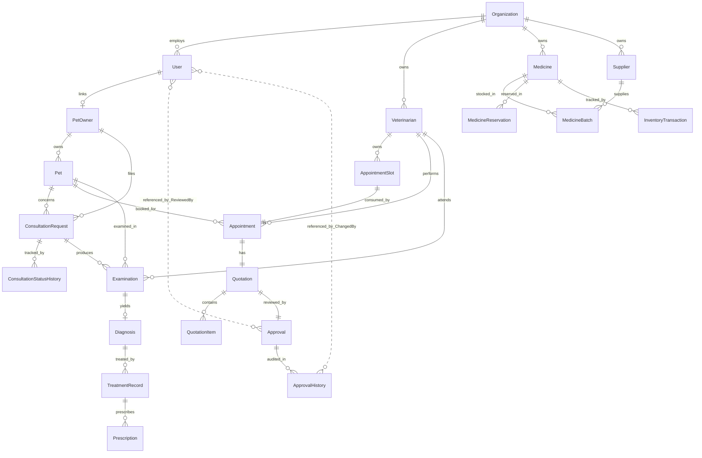

# Database Design

This document describes the actual PostgreSQL / Entity Framework Core database design for the Scheduling, Billing & Approval Management component. All tables, columns, constraints, and relationships below are verified against `PetCare.Infrastructure/PetCareDbContext.cs`, the per-entity EF Core configurations in `PetCare.Infrastructure/Configurations/`, and the domain entities in `PetCare.Domain/Entities/`.

---

## 1. Database overview

The component persists its data in a PostgreSQL database accessed through Entity Framework Core 8. The `PetCareDbContext` defines 22 `DbSet<T>` entries covering scheduling/billing/approval, pet/consultation, clinical (examination→diagnosis→treatment→prescription), and medicine/inventory modules, and applies all entity configurations from the Infrastructure assembly. Audit timestamps (`CreatedAt`, `UpdatedAt`) are stamped server-side by a `SaveChanges` override so clients can never spoof them.

---

## 2. Database technology

| Aspect | Value |
|---|---|
| Database engine | PostgreSQL 18 |
| ORM | Entity Framework Core 8.0.10 |
| PostgreSQL provider | `Npgsql.EntityFrameworkCore.PostgreSQL` 8.0.10 |
| DbContext | `PetCare.Infrastructure.PetCareDbContext` |
| Design-time factory | `PetCareDbContextFactory` |

---

## 3. Tables / entities actually present

All 22 tables below are confirmed as `DbSet<T>` properties in `PetCareDbContext` and as `ToTable("...")` calls in their respective EF configurations.

| DbSet | Table name | Entity class | Configuration |
|---|---|---|---|
| `Veterinarians` | `Veterinarians` | `Veterinarian` | `VeterinarianConfiguration` |
| `AppointmentSlots` | `AppointmentSlots` | `AppointmentSlot` | `AppointmentSlotConfiguration` |
| `Appointments` | `Appointments` | `Appointment` | `AppointmentConfiguration` |
| `Quotations` | `Quotations` | `Quotation` | `QuotationConfiguration` |
| `QuotationItems` | `QuotationItems` | `QuotationItem` | `QuotationItemConfiguration` |
| `Approvals` | `Approvals` | `Approval` | `ApprovalConfiguration` |
| `ApprovalHistories` | `ApprovalHistories` | `ApprovalHistory` | `ApprovalHistoryConfiguration` |
| `Users` | `Users` | `User` | `UserConfiguration` |
| `Organizations` | `Organizations` | `Organization` | `OrganizationConfiguration` |
| `PetOwners` | `PetOwners` | `PetOwner` | `PetOwnerConfiguration` |
| `Pets` | `Pets` | `Pet` | `PetConfiguration` |
| `ConsultationRequests` | `ConsultationRequests` | `ConsultationRequest` | `ConsultationRequestConfiguration` |
| `ConsultationStatusHistories` | `ConsultationStatusHistories` | `ConsultationStatusHistory` | `ConsultationStatusHistoryConfiguration` |
| `Examinations` | `Examinations` | `Examination` | `ExaminationConfiguration` |
| `Diagnoses` | `Diagnoses` | `Diagnosis` | `DiagnosisConfiguration` |
| `TreatmentRecords` | `TreatmentRecords` | `TreatmentRecord` | `TreatmentRecordConfiguration` |
| `Prescriptions` | `Prescriptions` | `Prescription` | `PrescriptionConfiguration` |
| `Medicines` | `Medicines` | `Medicine` | `MedicineConfiguration` |
| `Suppliers` | `Suppliers` | `Supplier` | `SupplierConfiguration` |
| `MedicineBatches` | `MedicineBatches` | `MedicineBatch` | `MedicineBatchConfiguration` |
| `MedicineReservations` | `MedicineReservations` | `MedicineReservation` | `MedicineReservationConfiguration` |
| `InventoryTransactions` | `InventoryTransactions` | `InventoryTransaction` | `InventoryTransactionConfiguration` |

---

## 4. Entity details

### Veterinarian (`Veterinarians`)

| Attribute | Type | Constraints |
|---|---|---|
| `Id` | Guid | PK, default `gen_random_uuid()` |
| `Name` | string | Required, max 150 |
| `Specialisation` | string | Required, max 150 |
| `Branch` | string | Required, max 100 |
| `Active` | bool | Required, default `true` |
| `OrganizationId` | Guid? | Nullable FK → `Organizations` (tenant ownership; added in the pre-migration corrections) |
| `CreatedAt` | DateTimeOffset | Required, default `now()` |
| `UpdatedAt` | DateTimeOffset | Required, default `now()` |

**Relationships:** 1→many `AppointmentSlot`, 1→many `Appointment` (both `Restrict` delete); many→1 `Organization`. Referenced by `Examination.VeterinarianId` (`Restrict`) — the examination's organization scope is carried transitively through this link.
**Seed data:** 3 veterinarians seeded via `HasData` (Dr. Anika Perera/Colombo, Dr. Rohan Fernando/Kandy, Dr. Nadee Silva/Galle) with fixed GUIDs from `SeedIds`.

### AppointmentSlot (`AppointmentSlots`)

| Attribute | Type | Constraints |
|---|---|---|
| `Id` | Guid | PK, default `gen_random_uuid()` |
| `VeterinarianId` | Guid | FK → `Veterinarians` |
| `Date` | date | Required |
| `StartTime` | time | Required |
| `EndTime` | time | Required, CHECK `EndTime > StartTime` |
| `Branch` | string | Required, max 100 |
| `Status` | string (enum) | Required, max 20, default `Available` |
| `CreatedAt` | DateTimeOffset | Required, default `now()` |
| `UpdatedAt` | DateTimeOffset | Required, default `now()` |

**Indexes:**
- Unique: `(VeterinarianId, Date, StartTime)` — prevents double-booking the same vet at the same start time.
- `(VeterinarianId, Date)` — fast availability lookups.
- `StartTime` — `IX_AppointmentSlot_StartTime`.

**Relationships:** belongs to `Veterinarian` (`Restrict`); 1:1 with `Appointment` (`Restrict`).
**Seed data:** 4 slots seeded via `HasData` (fixed GUIDs from `SeedIds`).

### Appointment (`Appointments`)

| Attribute | Type | Constraints |
|---|---|---|
| `Id` | Guid | PK, default `gen_random_uuid()` |
| `PetId` | string | Required, **FK → `Pets`** (changed from `Guid` to match the canonical `Pet.Id` string type; real relationship configured in the pre-migration corrections) |
| `VeterinarianId` | Guid | FK → `Veterinarians` |
| `AppointmentSlotId` | Guid | FK → `AppointmentSlots`, **unique** |
| `Date` | date | Required |
| `StartTime` | time | Required |
| `EndTime` | time | Required, CHECK `EndTime > StartTime` |
| `Status` | string (enum) | Required, max 20, default `Reserved` |
| `Notes` | text | Nullable |
| `CreatedAt` | DateTimeOffset | Required, default `now()` |
| `UpdatedAt` | DateTimeOffset | Required, default `now()` |

**Indexes:**
- Unique: `AppointmentSlotId` — one confirmed appointment consumes exactly one slot.
- `PetId` — `IX_Appointment_PetId`.
- `(VeterinarianId, Date)` — `IX_Appointment_VeterinarianId_Date`.
- `VeterinarianId` — `IX_Appointment_VeterinarianId`.
- `Date` — `IX_Appointment_ScheduledStart`.
- `Status` — `IX_Appointment_Status`.

**Relationships:** belongs to `Pet` (FK `PetId` → `Pets.Id`); belongs to `Veterinarian` (`Restrict`); 1:1 with `AppointmentSlot` (`Restrict`); 1:1 with `Quotation` (`Restrict`, FK owned by `Quotation`).

### Quotation (`Quotations`)

| Attribute | Type | Constraints |
|---|---|---|
| `Id` | Guid | PK, default `gen_random_uuid()` |
| `AppointmentId` | Guid | FK → `Appointments`, **unique** |
| `Budget` | numeric(12,2) | Required, CHECK `>= 0` |
| `Subtotal` | numeric(12,2) | Required, default 0, CHECK `>= 0` |
| `Total` | numeric(12,2) | Required, default 0, CHECK `>= 0` |
| `Status` | string (enum) | Required, max 20, default `Draft` |
| `CreatedAt` | DateTimeOffset | Required, default `now()` |
| `UpdatedAt` | DateTimeOffset | Required, default `now()` |

**Indexes:** Unique `AppointmentId` (1:1 rule); `Status` — `IX_Quotation_Status`.
**Relationships:** 1:1 with `Appointment` (`Restrict`); 1→many `QuotationItem` (`Cascade`); 1:1 with `Approval` (`Restrict`, FK owned by `Approval`).

### QuotationItem (`QuotationItems`)

| Attribute | Type | Constraints |
|---|---|---|
| `Id` | Guid | PK, default `gen_random_uuid()` |
| `QuotationId` | Guid | FK → `Quotations` |
| `Category` | string | Required, max 20, CHECK in (`Consultation`, `Examination`, `Treatment`, `Medicine`, `Other`) |
| `Description` | string | Required, max 500 |
| `Quantity` | int | Required, CHECK `> 0` |
| `UnitPrice` | numeric(10,2) | Required, CHECK `>= 0` |
| `TotalPrice` | numeric(12,2) | Required, CHECK `>= 0`, CHECK `= Quantity * UnitPrice` |

**Indexes:** `QuotationId` — `IX_QuotationItem_QuotationId`.
**Relationships:** belongs to `Quotation` (`Cascade` delete).

### Approval (`Approvals`)

| Attribute | Type | Constraints |
|---|---|---|
| `Id` | Guid | PK, default `gen_random_uuid()` |
| `QuotationId` | Guid | FK → `Quotations`, **unique** |
| `Status` | string (enum) | Required, max 20, default `Pending` |
| `ReviewedBy` | Guid? | Nullable; CHECK: required when `Status != 'Pending'` |
| `ReviewedAt` | DateTimeOffset? | Nullable |
| `Comment` | text | Nullable; CHECK: required (non-empty) when `Status` is `Rejected` or `RevisionRequested` |

**CHECK constraints:**
- `CK_Approval_ReviewedBy_Required_When_Decided`: `"Status" = 'Pending' OR "ReviewedBy" IS NOT NULL`
- `CK_Approval_Comment_Required_For_Reject_Or_Revision`: `"Status" NOT IN ('Rejected', 'RevisionRequested') OR ("Comment" IS NOT NULL AND length(btrim("Comment")) > 0)`

**Indexes:** Unique `QuotationId` (1:1 rule); `Status` — `IX_Approval_Status`.
**Relationships:** 1:1 with `Quotation` (`Restrict`); 1→many `ApprovalHistory` (`Cascade`).

### ApprovalHistory (`ApprovalHistories`)

| Attribute | Type | Constraints |
|---|---|---|
| `Id` | Guid | PK, default `gen_random_uuid()` |
| `ApprovalId` | Guid | FK → `Approvals` |
| `PreviousStatus` | string (enum) | Required, max 20 |
| `NewStatus` | string (enum) | Required, max 20 |
| `ChangedBy` | Guid | Required |
| `Reason` | text | Nullable |
| `ChangedAt` | DateTimeOffset | Required, default `now()` |

**Indexes:** `(ApprovalId, ChangedAt)` — `IX_ApprovalHistory_ApprovalId_ChangedAt`.
**Relationships:** belongs to `Approval` (`Cascade` delete).

### User (`Users`)

| Attribute | Type | Constraints |
|---|---|---|
| `Id` | Guid | PK, default `gen_random_uuid()` |
| `Email` | string | Required, max 256, **unique index** |
| `PasswordHash` | string | Required |
| `Name` | string | Required, max 150 |
| `Role` | string | Required, max 50 |
| `Active` | bool | Required, default `true` |
| `OrganizationId` | Guid? | Nullable FK → `Organizations` — staff accounts belong to an organization; PetOwner/Administrator accounts have none |
| `CreatedAt` | DateTimeOffset | Required, default `now()` |
| `UpdatedAt` | DateTimeOffset | Required, default `now()` |

**Relationships:** many→1 `Organization` (`Restrict`); 1:1 with `PetOwner` via `PetOwner.UserId` (added in the pre-migration corrections — owner identity is resolved through this link, not by matching email). Referenced by `Approval.ReviewedBy` and `ApprovalHistory.ChangedBy` as `Guid` values. No FK constraint is created from `Approvals`/`ApprovalHistories` to `Users` in the current schema (the references are by Guid value only).

---

## 5. Relationships



### Delete behaviors

| Relationship | Delete behavior |
|---|---|
| Veterinarian → AppointmentSlot | `Restrict` |
| Veterinarian → Appointment | `Restrict` |
| AppointmentSlot ↔ Appointment | `Restrict` |
| Appointment ↔ Quotation | `Restrict` |
| Quotation → QuotationItem | `Cascade` |
| Quotation ↔ Approval | `Restrict` |
| Approval → ApprovalHistory | `Cascade` |

---

## 6. ID strategy

Primary keys are `Guid` with a database default of `gen_random_uuid()` for most tables (scheduling, billing, approval, user/organization, inventory). The pet-domain entities use **string** primary keys (`Pet.Id`, `PetOwner.Id`, `ConsultationRequest.Id` — e.g. `PET-…`, `OWN-…`), and `Appointment.PetId`/`Examination.PetId` are `string` FK columns matching them. The project does not use auto-increment integer keys.

---

## 7. Audit fields

`AuditableEntity` (in `PetCare.Domain/Common/AuditableEntity.cs`) is the base class for `Veterinarian`, `AppointmentSlot`, `Appointment`, `Quotation`, and `User`. It provides:

- `Guid Id`
- `DateTimeOffset CreatedAt`
- `DateTimeOffset UpdatedAt`

`Approval`, `ApprovalHistory`, and `QuotationItem` do **not** inherit from `AuditableEntity` — they use `ReviewedAt`/`ChangedAt` for decision timestamps and are recomputed as a unit rather than individually audited.

The `PetCareDbContext.SaveChangesAsync` override stamps `CreatedAt` on insert and `UpdatedAt` on update, and prevents `CreatedAt` from being modified on update:

```csharp
if (entry.State == EntityState.Added)
{
    entry.Entity.CreatedAt = now;
    entry.Entity.UpdatedAt = now;
}
else if (entry.State == EntityState.Modified)
{
    entry.Property(e => e.CreatedAt).IsModified = false;
    entry.Entity.UpdatedAt = now;
}
```

---

## 8. EF Core migrations

The following migrations exist in `PetCare.Infrastructure/Migrations/` (exact names verified from the file system):

| Migration file | Migration name |
|---|---|
| `20260820110944_InitialSchedulingBillingApproval.cs` | `InitialSchedulingBillingApproval` |
| `20260826163603_AddUsers.cs` | `AddUsers` |

### Database history note

The `AddUsers` migration exists in the current project history. It was applied to the development database. It has **not** been removed or rolled back. The database is **not** in a pre-`AddUsers` state. No new migration was created to conceal or reverse it.

`DevelopmentSeeder.cs` and `SeedIds.cs` exist in `PetCare.Infrastructure/Seed/` but are **not** invoked from `Program.cs` — there is no automatic startup seeding in the current code. Reference data (`Veterinarian`, `AppointmentSlot`) is seeded via EF Core `HasData` in the migration itself.

### Model–schema drift (pre-migration corrections, 2026-09-24)

The EF Core model has been corrected ahead of the schema on the `backend/pre-migration-corrections` branch. **No migration has been generated yet** — the changes below exist only in the entity/configuration code:

- `Appointments.PetId`: `Guid` → `string`, real FK → `Pets.Id` (was an unconstrained cross-module `uuid`).
- `PetOwners.UserId`: new column, one-to-one FK → `Users.Id` (replaces email-matching for ownership).
- `Veterinarians.OrganizationId`, `Medicines.OrganizationId`, `Suppliers.OrganizationId`: new nullable tenant columns.
- `Examination.VeterinarianId`: now a configured FK → `Veterinarians` (was unmodelled).
- All tables absent from migration history still need to be created by the final migration: `Organizations`, `PetOwners`, `Pets`, `ConsultationRequests`, `ConsultationStatusHistories`, `Examinations`, `Diagnoses`, `TreatmentRecords`, `Prescriptions`, `Medicines`, `Suppliers`, `MedicineBatches`, `MedicineReservations`, `InventoryTransactions`.

**Required backfills in the final migration:** `PetOwners.UserId` (match by email); `OrganizationId` on org-owned rows (rows left NULL are invisible to org-scoped staff by design).

---

## 9. Database safety

- No credentials, connection strings, or secrets appear in this document.
- The connection string is resolved from `ConnectionStrings:PetCareDb` (user secrets / appsettings) or the `PETCARE_DB_CONNECTION` environment variable. No hardcoded fallback exists.
- `appsettings.json` and `appsettings.Development.json` contain empty `PetCareDb` values with comments instructing developers to use user secrets or the environment variable.

---

## 10. Current database limitations / notes

- **Model–schema drift:** The development database still reflects the two old migrations; the corrected model (string `PetId` + FK, `PetOwners.UserId`, tenant columns, all missing tables) is pending the final consolidated migration — see §8.
- **No FK from `Approvals`/`ApprovalHistories` to `Users`:** `ReviewedBy` and `ChangedBy` are stored as `Guid` values but are not FK-constrained to the `Users` table in the current schema.
- **`DevelopmentSeeder` is not invoked at startup:** The seeder class exists but `Program.cs` does not call it. Development users must be inserted manually or via a separate one-time seeding step if needed.
- **`AddUsers` migration remains applied:** The migration and any inserted user rows remain in the development database. No rollback was performed.
