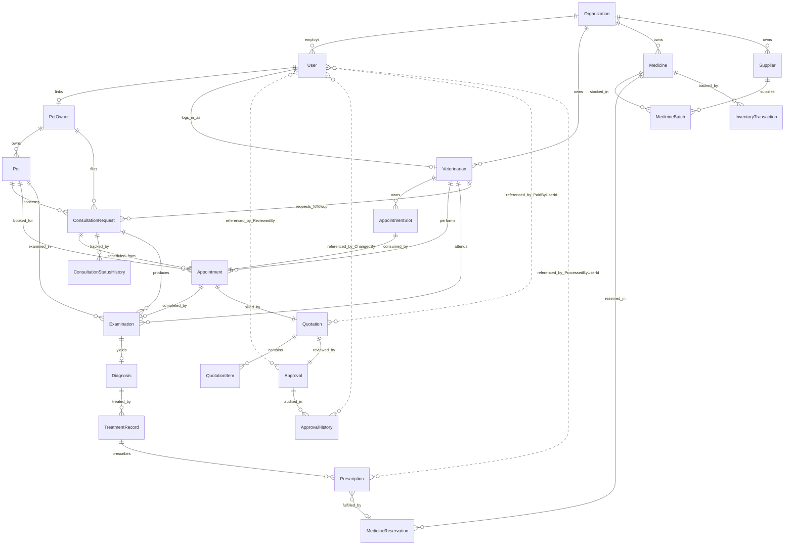

# Database Design

This document describes the actual PostgreSQL / Entity Framework Core database design for the Scheduling, Billing & Approval Management component. All tables, columns, constraints, and relationships below are verified against `PetCare.Infrastructure/PetCareDbContext.cs`, the per-entity EF Core configurations in `PetCare.Infrastructure/Configurations/`, and the domain entities in `PetCare.Domain/Entities/`.

---

## 1. Database overview

The component persists its data in a PostgreSQL database accessed through Entity Framework Core 8. The `PetCareDbContext` defines 22 `DbSet<T>` entries covering scheduling/billing/approval, pet/consultation, clinical (examination→diagnosis→treatment→prescription), and medicine/inventory modules, and applies all entity configurations from the Infrastructure assembly. Audit timestamps (`CreatedAt`, `UpdatedAt`) are stamped server-side by a `SaveChanges` override so clients can never spoof them.

---

## 2. Database technology

| Aspect | Value |
|---|---|
| Database engine | PostgreSQL 18 |
| ORM | Entity Framework Core 8.0.10 |
| PostgreSQL provider | `Npgsql.EntityFrameworkCore.PostgreSQL` 8.0.10 |
| DbContext | `PetCare.Infrastructure.PetCareDbContext` |
| Design-time factory | `PetCareDbContextFactory` |

---

## 3. Tables / entities actually present

All 22 tables below are confirmed as `DbSet<T>` properties in `PetCareDbContext` and as `ToTable("...")` calls in their respective EF configurations.

| DbSet | Table name | Entity class | Configuration |
|---|---|---|---|
| `Veterinarians` | `Veterinarians` | `Veterinarian` | `VeterinarianConfiguration` |
| `AppointmentSlots` | `AppointmentSlots` | `AppointmentSlot` | `AppointmentSlotConfiguration` |
| `Appointments` | `Appointments` | `Appointment` | `AppointmentConfiguration` |
| `Quotations` | `Quotations` | `Quotation` | `QuotationConfiguration` |
| `QuotationItems` | `QuotationItems` | `QuotationItem` | `QuotationItemConfiguration` |
| `Approvals` | `Approvals` | `Approval` | `ApprovalConfiguration` |
| `ApprovalHistories` | `ApprovalHistories` | `ApprovalHistory` | `ApprovalHistoryConfiguration` |
| `Users` | `Users` | `User` | `UserConfiguration` |
| `Organizations` | `Organizations` | `Organization` | `OrganizationConfiguration` |
| `PetOwners` | `PetOwners` | `PetOwner` | `PetOwnerConfiguration` |
| `Pets` | `Pets` | `Pet` | `PetConfiguration` |
| `ConsultationRequests` | `ConsultationRequests` | `ConsultationRequest` | `ConsultationRequestConfiguration` |
| `ConsultationStatusHistories` | `ConsultationStatusHistories` | `ConsultationStatusHistory` | `ConsultationStatusHistoryConfiguration` |
| `Examinations` | `Examinations` | `Examination` | `ExaminationConfiguration` |
| `Diagnoses` | `Diagnoses` | `Diagnosis` | `DiagnosisConfiguration` |
| `TreatmentRecords` | `TreatmentRecords` | `TreatmentRecord` | `TreatmentRecordConfiguration` |
| `Prescriptions` | `Prescriptions` | `Prescription` | `PrescriptionConfiguration` |
| `Medicines` | `Medicines` | `Medicine` | `MedicineConfiguration` |
| `Suppliers` | `Suppliers` | `Supplier` | `SupplierConfiguration` |
| `MedicineBatches` | `MedicineBatches` | `MedicineBatch` | `MedicineBatchConfiguration` |
| `MedicineReservations` | `MedicineReservations` | `MedicineReservation` | `MedicineReservationConfiguration` |
| `InventoryTransactions` | `InventoryTransactions` | `InventoryTransaction` | `InventoryTransactionConfiguration` |

---

## 4. Entity details

### Veterinarian (`Veterinarians`)

| Attribute | Type | Constraints |
|---|---|---|
| `Id` | Guid | PK, default `gen_random_uuid()` |
| `Name` | string | Required, max 150 |
| `Specialisation` | string | Required, max 150 |
| `Branch` | string | Required, max 100 |
| `Active` | bool | Required, default `true` |
| `OrganizationId` | Guid? | Nullable FK → `Organizations` (tenant ownership; added in the pre-migration corrections) |
| `UserId` | Guid? | Nullable FK → `Users`, unique filtered index (`"UserId" IS NOT NULL`) — the login ↔ vet-profile link added in `WorkflowRedesign`; resolved server-side by `CurrentVeterinarianResolver` |
| `CreatedAt` | DateTimeOffset | Required, default `now()` |
| `UpdatedAt` | DateTimeOffset | Required, default `now()` |

**Relationships:** 1→many `AppointmentSlot`, 1→many `Appointment` (both `Restrict` delete); many→1 `Organization`; optional 1:1 with `User` (`UserId`, `Restrict` delete). Referenced by `Examination.VeterinarianId` (`Restrict`) — the examination's organization scope is carried transitively through this link — and by `ConsultationRequest.RequestedByVeterinarianId` (`SetNull`).
**Seed data:** 3 veterinarians seeded via `HasData` (Dr. Anika Perera/Colombo, Dr. Rohan Fernando/Kandy, Dr. Nadee Silva/Galle) with fixed GUIDs from `SeedIds`. These rows have `UserId = NULL` — they cannot be logged into; vets created via `POST /api/manager/users/veterinarians` get a linked `Veterinarian` row automatically.

### AppointmentSlot (`AppointmentSlots`)

| Attribute | Type | Constraints |
|---|---|---|
| `Id` | Guid | PK, default `gen_random_uuid()` |
| `VeterinarianId` | Guid | FK → `Veterinarians` |
| `Date` | date | Required |
| `StartTime` | time | Required |
| `EndTime` | time | Required, CHECK `EndTime > StartTime` |
| `Branch` | string | Required, max 100 |
| `Status` | string (enum) | Required, max 20, default `Available` |
| `CreatedAt` | DateTimeOffset | Required, default `now()` |
| `UpdatedAt` | DateTimeOffset | Required, default `now()` |

**Indexes:**
- Unique: `(VeterinarianId, Date, StartTime)` — prevents double-booking the same vet at the same start time.
- `(VeterinarianId, Date)` — fast availability lookups.
- `StartTime` — `IX_AppointmentSlot_StartTime`.

**Relationships:** belongs to `Veterinarian` (`Restrict`); 1:1 with `Appointment` (`Restrict`).
**Seed data:** 4 slots seeded via `HasData` (fixed GUIDs from `SeedIds`).

### Appointment (`Appointments`)

| Attribute | Type | Constraints |
|---|---|---|
| `Id` | Guid | PK, default `gen_random_uuid()` |
| `PetId` | string | Required, **FK → `Pets`** (changed from `Guid` to match the canonical `Pet.Id` string type; real relationship configured in the pre-migration corrections) |
| `VeterinarianId` | Guid | FK → `Veterinarians` |
| `AppointmentSlotId` | Guid | FK → `AppointmentSlots`, **unique** |
| `Date` | date | Required |
| `StartTime` | time | Required |
| `EndTime` | time | Required, CHECK `EndTime > StartTime` |
| `Status` | string (enum) | Required, max 20, default `Reserved` |
| `Notes` | text | Nullable |
| `ConsultationRequestId` | varchar(30)? | Nullable FK → `ConsultationRequests` (`SetNull` delete) — the request this appointment was scheduled from (added in `WorkflowRedesign`) |
| `Type` | string (enum) | Required, max 20, default `Initial` — `Initial` or `FollowUp`, inherited from `ConsultationRequest.RequestType` at assignment |
| `CreatedAt` | DateTimeOffset | Required, default `now()` |
| `UpdatedAt` | DateTimeOffset | Required, default `now()` |

**Indexes:**
- Unique: `AppointmentSlotId` — one confirmed appointment consumes exactly one slot.
- `PetId` — `IX_Appointment_PetId`.
- `(VeterinarianId, Date)` — `IX_Appointment_VeterinarianId_Date`.
- `VeterinarianId` — `IX_Appointment_VeterinarianId`.
- `Date` — `IX_Appointment_ScheduledStart`.
- `Status` — `IX_Appointment_Status`.
- `ConsultationRequestId` — `IX_Appointment_ConsultationRequestId` (added in `WorkflowRedesign`).

**Relationships:** belongs to `Pet` (FK `PetId` → `Pets.Id`); belongs to `Veterinarian` (`Restrict`); 1:1 with `AppointmentSlot` (`Restrict`); 1:1 with `Quotation` (`Restrict`, FK owned by `Quotation`); optional many→1 `ConsultationRequest` (`SetNull`); optionally referenced by `Examination.AppointmentId` (`SetNull`).

### Quotation (`Quotations`)

| Attribute | Type | Constraints |
|---|---|---|
| `Id` | Guid | PK, default `gen_random_uuid()` |
| `AppointmentId` | Guid | FK → `Appointments`, **unique** |
| `Budget` | numeric(12,2) | Required, CHECK `>= 0` |
| `Subtotal` | numeric(12,2) | Required, default 0, CHECK `>= 0` |
| `Total` | numeric(12,2) | Required, default 0, CHECK `>= 0` |
| `Status` | string (enum) | Required, max 20, default `Draft` |
| `PaymentStatus` | string (enum) | Required, max 20, default `Pending` — `Pending`/`Paid` (added in `WorkflowRedesign`); the Quotation doubles as the bill |
| `PaidAt` | DateTimeOffset? | Nullable — stamped on `mark-paid` |
| `PaidByUserId` | Guid? | Nullable FK → `Users` (`SetNull`) — who recorded the payment |
| `CreatedAt` | DateTimeOffset | Required, default `now()` |
| `UpdatedAt` | DateTimeOffset | Required, default `now()` |

**Indexes:** Unique `AppointmentId` (1:1 rule); `Status` — `IX_Quotation_Status`; `PaidByUserId` — `IX_Quotation_PaidByUserId`.
**Relationships:** 1:1 with `Appointment` (`Restrict`); 1→many `QuotationItem` (`Cascade`); 1:1 with `Approval` (`Restrict`, FK owned by `Approval`); many→1 `User` via `PaidByUserId` (`SetNull`). `QuotationResponse` exposes a derived `InvoiceNumber` (`INV-` + first 8 hex chars of `Id`) — not a stored column or sequential counter.

### QuotationItem (`QuotationItems`)

| Attribute | Type | Constraints |
|---|---|---|
| `Id` | Guid | PK, default `gen_random_uuid()` |
| `QuotationId` | Guid | FK → `Quotations` |
| `Category` | string | Required, max 20, CHECK in (`Consultation`, `Examination`, `Treatment`, `Medicine`, `Other`) |
| `Description` | string | Required, max 500 |
| `Quantity` | int | Required, CHECK `> 0` |
| `UnitPrice` | numeric(10,2) | Required, CHECK `>= 0` |
| `TotalPrice` | numeric(12,2) | Required, CHECK `>= 0`, CHECK `= Quantity * UnitPrice` |

**Indexes:** `QuotationId` — `IX_QuotationItem_QuotationId`.
**Relationships:** belongs to `Quotation` (`Cascade` delete).

### Approval (`Approvals`)

| Attribute | Type | Constraints |
|---|---|---|
| `Id` | Guid | PK, default `gen_random_uuid()` |
| `QuotationId` | Guid | FK → `Quotations`, **unique** |
| `Status` | string (enum) | Required, max 20, default `Pending` |
| `ReviewedBy` | Guid? | Nullable; CHECK: required when `Status != 'Pending'` |
| `ReviewedAt` | DateTimeOffset? | Nullable |
| `Comment` | text | Nullable; CHECK: required (non-empty) when `Status` is `Rejected` or `RevisionRequested` |

**CHECK constraints:**
- `CK_Approval_ReviewedBy_Required_When_Decided`: `"Status" = 'Pending' OR "ReviewedBy" IS NOT NULL`
- `CK_Approval_Comment_Required_For_Reject_Or_Revision`: `"Status" NOT IN ('Rejected', 'RevisionRequested') OR ("Comment" IS NOT NULL AND length(btrim("Comment")) > 0)`

**Indexes:** Unique `QuotationId` (1:1 rule); `Status` — `IX_Approval_Status`.
**Relationships:** 1:1 with `Quotation` (`Restrict`); 1→many `ApprovalHistory` (`Cascade`).

### ApprovalHistory (`ApprovalHistories`)

| Attribute | Type | Constraints |
|---|---|---|
| `Id` | Guid | PK, default `gen_random_uuid()` |
| `ApprovalId` | Guid | FK → `Approvals` |
| `PreviousStatus` | string (enum) | Required, max 20 |
| `NewStatus` | string (enum) | Required, max 20 |
| `ChangedBy` | Guid | Required |
| `Reason` | text | Nullable |
| `ChangedAt` | DateTimeOffset | Required, default `now()` |

**Indexes:** `(ApprovalId, ChangedAt)` — `IX_ApprovalHistory_ApprovalId_ChangedAt`.
**Relationships:** belongs to `Approval` (`Cascade` delete).

### User (`Users`)

| Attribute | Type | Constraints |
|---|---|---|
| `Id` | Guid | PK, default `gen_random_uuid()` |
| `Email` | string | Required, max 256, **unique index** |
| `PasswordHash` | string | Required |
| `Name` | string | Required, max 150 |
| `Role` | string | Required, max 50 |
| `Active` | bool | Required, default `true` |
| `OrganizationId` | Guid? | Nullable FK → `Organizations` — staff accounts belong to an organization; PetOwner/Administrator accounts have none |
| `CreatedAt` | DateTimeOffset | Required, default `now()` |
| `UpdatedAt` | DateTimeOffset | Required, default `now()` |

**Relationships:** many→1 `Organization` (`Restrict`); 1:1 with `PetOwner` via `PetOwner.UserId` (added in the pre-migration corrections — owner identity is resolved through this link, not by matching email); optional 1:1 with `Veterinarian` via `Veterinarian.UserId` (`WorkflowRedesign`). Referenced by `Approval.ReviewedBy` and `ApprovalHistory.ChangedBy` as `Guid` values. No FK constraint is created from `Approvals`/`ApprovalHistories` to `Users` in the current schema (the references are by Guid value only). `WorkflowRedesign` adds real FKs from `Quotation.PaidByUserId` and `Prescription.ProcessedByUserId` → `Users` (`SetNull`).

### BookingRules / OrganizationLocation columns (added by `20260927070805_BookingRules` and `20260927081008_OrganizationLocation`)

| Table | New column | Type / constraint |
|---|---|---|
| `ConsultationRequests` | `OrganizationId` | `uuid?` — indexed FK → `Organizations` (`SetNull`); the clinic the owner booked at (nullable for legacy rows) |
| `Organizations` | `Latitude` | `double precision` nullable — clinic map coordinate (lat ±90 validated on registration) |
| `Organizations` | `Longitude` | `double precision` nullable — clinic map coordinate (lng ±180) |

The unique index `IX_AppointmentSlots_VeterinarianId_Date_StartTime` (since `InitialSchedulingBillingApproval`) is what converts a concurrent assign on the same vet/slot into SQLSTATE 23505 → 409; `BookingRules` adds the org link the booking rules validate against (`ConsultationRequests.PreferredDate` and the hour-aligned start time on the request DTOs are validated in the service/validator layer, not new columns).

### WorkflowRedesign columns on other tables (added by `20260926165049_WorkflowRedesign`)

These tables belong to the pet/clinical/inventory domains (documented in their own model docs); the workflow redesign added these columns:

| Table | New column | Type / constraint |
|---|---|---|
| `Examinations` | `AppointmentId` | `uuid?` — unique filtered index (`IS NOT NULL`); FK → `Appointments` (`SetNull`); links the exam to the appointment it completes |
| `Examinations` | `VeterinarianCharge` | `numeric(18,2)` NOT NULL default 0 — the vet's fee, billed as the `Examination`-category quotation line |
| `Prescriptions` | `Quantity` | `integer` NOT NULL default 1 |
| `Prescriptions` | `Frequency` | `varchar(100)?` |
| `Prescriptions` | `Instructions` | `varchar(500)?` |
| `Prescriptions` | `RequestStatus` | `varchar(20)` NOT NULL default `Pending` — `Pending`/`Issued`/`Unavailable` (`MedicineRequestStatus`); indexed `IX_Prescriptions_RequestStatus` |
| `Prescriptions` | `UnavailableReason` | `varchar(500)?` — required by the service when marking `Unavailable` |
| `Prescriptions` | `ReservationId` | `uuid?` — FK → `MedicineReservations` (`SetNull`); links the fulfilled reservation |
| `Prescriptions` | `ProcessedByUserId` | `uuid?` — FK → `Users` (`SetNull`) |
| `Prescriptions` | `ProcessedAt` | `timestamptz?` |
| `ConsultationRequests` | `RequestType` | `varchar(20)` NOT NULL default `Initial` — CHECK `IN ('Initial','FollowUp')` (`CK_ConsultationRequest_RequestType_Allowed`) |
| `ConsultationRequests` | `RequestedByVeterinarianId` | `uuid?` — FK → `Veterinarians` (`SetNull`); set for vet-filed follow-ups |

New enums in `PetCare.Domain/Enums`: `MedicineRequestStatus` (`Pending`/`Issued`/`Unavailable`), `PaymentStatus` (`Pending`/`Paid`), `AppointmentType` (`Initial`/`FollowUp`) — all stored as `varchar(20)` strings.

---

## 5. Relationships


```mermaid
erDiagram
    Organization ||--o{ User : employs
    Organization ||--o{ Veterinarian : owns
    Organization ||--o{ Medicine : owns
    Organization ||--o{ Supplier : owns
    User ||--o| PetOwner : links
    User ||--o| Veterinarian : logs_in_as
    PetOwner ||--o{ Pet : owns
    PetOwner ||--o{ ConsultationRequest : files
    Pet ||--o{ ConsultationRequest : concerns
    Pet ||--o{ Appointment : booked_for
    Pet ||--o{ Examination : examined_in
    Veterinarian ||--o{ AppointmentSlot : owns
    Veterinarian ||--o{ Appointment : performs
    Veterinarian ||--o{ Examination : attends
    Veterinarian ||--o{ ConsultationRequest : requests_followup
    AppointmentSlot ||--|| Appointment : consumed_by
    ConsultationRequest ||--o{ Appointment : scheduled_from
    Appointment ||--o| Examination : completed_by
    Appointment ||--|| Quotation : billed_by
    Quotation ||--o{ QuotationItem : contains
    Quotation ||--|| Approval : reviewed_by
    Approval ||--o{ ApprovalHistory : audited_in
    ConsultationRequest ||--o{ ConsultationStatusHistory : tracked_by
    ConsultationRequest ||--o{ Examination : produces
    Examination ||--o| Diagnosis : yields
    Diagnosis ||--o{ TreatmentRecord : treated_by
    TreatmentRecord ||--o{ Prescription : prescribes
    Medicine ||--o{ MedicineBatch : stocked_in
    Medicine ||--o{ MedicineReservation : reserved_in
    Medicine ||--o{ InventoryTransaction : tracked_by
    Prescription }o--o| MedicineReservation : fulfilled_by
    Supplier ||--o{ MedicineBatch : supplies
    User }o..o{ Approval : referenced_by_ReviewedBy
    User }o..o{ ApprovalHistory : referenced_by_ChangedBy
    User }o..o{ Quotation : referenced_by_PaidByUserId
    User }o..o{ Prescription : referenced_by_ProcessedByUserId
```

### Delete behaviors

| Relationship | Delete behavior |
|---|---|
| Veterinarian → AppointmentSlot | `Restrict` |
| Veterinarian → Appointment | `Restrict` |
| AppointmentSlot ↔ Appointment | `Restrict` |
| Appointment ↔ Quotation | `Restrict` |
| Quotation → QuotationItem | `Cascade` |
| Quotation ↔ Approval | `Restrict` |
| Approval → ApprovalHistory | `Cascade` |
| Veterinarian.UserId → User | `Restrict` |
| Appointment.ConsultationRequestId → ConsultationRequest | `SetNull` |
| ConsultationRequest.RequestedByVeterinarianId → Veterinarian | `SetNull` |
| Examination.AppointmentId → Appointment | `SetNull` |
| Prescription.ReservationId → MedicineReservation | `SetNull` |
| Prescription.ProcessedByUserId → User | `SetNull` |
| Quotation.PaidByUserId → User | `SetNull` |

---

## 6. ID strategy

Primary keys are `Guid` with a database default of `gen_random_uuid()` for most tables (scheduling, billing, approval, user/organization, inventory). The pet-domain entities use **string** primary keys (`Pet.Id`, `PetOwner.Id`, `ConsultationRequest.Id` — e.g. `PET-…`, `OWN-…`), and `Appointment.PetId`/`Examination.PetId` are `string` FK columns matching them. The project does not use auto-increment integer keys.

---

## 7. Audit fields

`AuditableEntity` (in `PetCare.Domain/Common/AuditableEntity.cs`) is the base class for `Veterinarian`, `AppointmentSlot`, `Appointment`, `Quotation`, and `User`. It provides:

- `Guid Id`
- `DateTimeOffset CreatedAt`
- `DateTimeOffset UpdatedAt`

`Approval`, `ApprovalHistory`, and `QuotationItem` do **not** inherit from `AuditableEntity` — they use `ReviewedAt`/`ChangedAt` for decision timestamps and are recomputed as a unit rather than individually audited.

The `PetCareDbContext.SaveChangesAsync` override stamps `CreatedAt` on insert and `UpdatedAt` on update, and prevents `CreatedAt` from being modified on update:

```csharp
if (entry.State == EntityState.Added)
{
    entry.Entity.CreatedAt = now;
    entry.Entity.UpdatedAt = now;
}
else if (entry.State == EntityState.Modified)
{
    entry.Property(e => e.CreatedAt).IsModified = false;
    entry.Entity.UpdatedAt = now;
}
```

---

## 8. EF Core migrations

The following migrations exist in `PetCare.Infrastructure/Migrations/` (exact names verified from the file system):

| Migration file | Migration name |
|---|---|
| `20260820110944_InitialSchedulingBillingApproval.cs` | `InitialSchedulingBillingApproval` |
| `20260826163603_AddUsers.cs` | `AddUsers` |
| `20260924105239_ConsolidatedDomainModel.cs` | `ConsolidatedDomainModel` |
| `20260926165049_WorkflowRedesign.cs` | `WorkflowRedesign` |
| `20260927070805_BookingRules.cs` | `BookingRules` |
| `20260927081008_OrganizationLocation.cs` | `OrganizationLocation` |

The first three are applied to the shared **Supabase PostgreSQL** database. Live schema verified post-migration: 23 tables (22 domain + history), 32 foreign keys, 9 unique indexes, 19 check constraints.

`WorkflowRedesign` is **additive-only** — it adds columns, indexes, foreign keys, and one CHECK constraint; nothing is dropped or renamed:

- **18 `AddColumn`** across `Veterinarians` (`UserId`), `Quotations` (`PaymentStatus`, `PaidAt`, `PaidByUserId`), `Prescriptions` (`Quantity`, `Frequency`, `Instructions`, `RequestStatus`, `UnavailableReason`, `ReservationId`, `ProcessedByUserId`, `ProcessedAt`), `Examinations` (`AppointmentId`, `VeterinarianCharge`), `ConsultationRequests` (`RequestType`, `RequestedByVeterinarianId`), `Appointments` (`ConsultationRequestId`, `Type`)
- **8 `CreateIndex`** (incl. unique filtered `Veterinarians.UserId` and `Examinations.AppointmentId`, plus `RequestStatus`/`ReservationId`/`ProcessedByUserId`/`PaidByUserId`/`RequestedByVeterinarianId`/`ConsultationRequestId` lookups)
- **7 `AddForeignKey`** (listed in the delete-behaviors table above)
- **1 check constraint** — `CK_ConsultationRequest_RequestType_Allowed` (`'Initial','FollowUp'`)

**Not yet applied to Supabase.** It must be applied (`dotnet ef database update` with `PETCARE_DB_CONNECTION` set — see `docs/setup/local-development.md`) before running the new API build against the shared database, or the new columns/relationships will fail at query time. The same applies to `BookingRules` (adds `ConsultationRequests.OrganizationId` + index + FK → `Organizations`) and `OrganizationLocation` (adds `Organizations.Latitude`/`Longitude` `double precision` nullable) — both additive-only and pending on Supabase; verified locally against disposable databases only.

### What `ConsolidatedDomainModel` delivered

- **New tables (14):** `Organizations`, `PetOwners`, `Pets`, `ConsultationRequests`, `ConsultationStatusHistories`, `Medicines`, `Suppliers`, `MedicineBatches`, `MedicineReservations`, `InventoryTransactions`, `Examinations`, `Diagnoses`, `TreatmentRecords`, `Prescriptions`
- `Appointments.PetId`: `uuid` → `varchar(30)` with a real FK → `Pets.Id`
- `PetOwners.UserId`: nullable `uuid`, one-to-one FK → `Users` (unique index)
- `OrganizationId` columns on `Users`, `Veterinarians`, `Medicines`, `Suppliers` (tenant scoping)
- `Approvals.ReviewedBy` and `ApprovalHistories.ChangedBy`: nullable `uuid` FKs → `Users` (system rows store `NULL`, not a sentinel)
- `Examination.VeterinarianId`: configured FK → `Veterinarians`

### ID strategy

- **`uuid`** — most entities (`User`, `Organization`, `Veterinarian`, all scheduling/billing/clinical/inventory entities), generated via `gen_random_uuid()`
- **`varchar(30)` business ids** — `Pet` (`PET-…`), `PetOwner` (`OWN-…`), `ConsultationRequest`; `Appointments.PetId` and `Examinations.PetId` reference these as text
- **`int` identity** — `ConsultationStatusHistory`

`DevelopmentSeeder.cs` and `SeedIds.cs` exist in `PetCare.Infrastructure/Seed/` but are **not** invoked from `Program.cs` — there is no automatic startup seeding. Reference data (`Veterinarian`, `AppointmentSlot`) is seeded via EF Core `HasData` in the migration itself.

---

## 9. Database safety

- No credentials, connection strings, or secrets appear in this document.
- The connection string is resolved from `ConnectionStrings:PetCareDb` (user secrets / appsettings) or the `PETCARE_DB_CONNECTION` environment variable. No hardcoded fallback exists.
- `appsettings.json` and `appsettings.Development.json` contain empty `PetCareDb` values with comments instructing developers to use user secrets or the environment variable.

---

## 10. Current database limitations / notes

- **`DevelopmentSeeder` is not invoked at startup:** The seeder class exists but `Program.cs` does not call it. The first Administrator and any demo accounts must be inserted manually or via a separate one-time seeding step.
- **`Organization.Status` is stored as `integer`** while sibling Status columns use `varchar` — model-consistent but flagged for uniformity.
- **Backfill reality for legacy data:** `OrganizationId` columns and `PetOwners.UserId` land `NULL` on migrated legacy rows — NULL-org rows are invisible to org-scoped staff until backfilled (by design).
- **`AddUsers` migration remains applied:** The migration and any inserted user rows remain in the database. No rollback was performed.
- **`WorkflowRedesign` / `BookingRules` / `OrganizationLocation` pending apply:** the model is ahead of the shared Supabase schema (new columns/FKs/indexes above); run the migrations before pointing the new API build at Supabase.
- **Seeded veterinarians are unlinkable:** the 3 `HasData` vet rows have `UserId = NULL`; only `POST /api/manager/users/veterinarians` creates a `Veterinarian` row linked to a login.

---

## 11. Agent workflow tables (migration `20261005135119_AddAgentWorkflows`)

Four tables owned by the ASP.NET system of record (the Python service has
no DB access). `text` columns store plan/proposal/tool-call/trajectory JSON.
All children cascade-delete with the workflow.

| Table | Key columns |
|---|---|
| `AgentWorkflows` | `Id` uuid PK; `ConsultationRequestId` varchar(30) FK → `ConsultationRequests` (**unique** `UX_AgentWorkflows_ConsultationRequestId`); `OrganizationId` uuid FK; `Objective`, `Status`, `CurrentStep`, `PlanJson`, `ProposalJson`, `ApprovedActionJson`, `SnapshotJson` (text); `DelegationCount`, `RevisionCount`, `FailureReason`; `InitiatedByUserId` FK → `Users`; `CreatedAt`/`UpdatedAt`/`CompletedAt` |
| `AgentWorkflowSteps` | `Id` uuid PK; `WorkflowId` FK → `AgentWorkflows` (`IX_AgentWorkflowSteps_WorkflowId`, cascade); `StepNumber`, `AgentName`, `Task`, `Status`, `RetryCount`, `InputSummaryJson`, `OutputJson`, `ToolCallsJson`, `ValidationSummaryJson`, `Error`, `StartedAt`/`CompletedAt` |
| `AgentWorkflowApprovals` | `Id` uuid PK; `WorkflowId` FK (cascade); `Status` (`Pending`/`Approved`/`Rejected`/`RevisionRequested`); `ProposalJson`; `DecidedByUserId` FK → `Users`; `DecidedAt`; `Comments` |
| `AgentWorkflowEvents` | `Id` uuid PK; `WorkflowId` FK (`IX_AgentWorkflowEvents_WorkflowId`, cascade); `Seq` int (backend-assigned, strictly increasing per workflow); `Timestamp`, `Node`, `Event`, `Agent`, `DetailJson` |

**ER addendum:** the ER diagram (`Scheduling-Billing-Approval-ER-v1.png`)
predates these tables. Textual addition: `AgentWorkflows` 1─* `AgentWorkflowSteps`,
1─* `AgentWorkflowApprovals`, 1─* `AgentWorkflowEvents`; `AgentWorkflows` *─1
`ConsultationRequests` (unique — one workflow per consultation) and *─1
`Organizations`; `InitiatedByUserId`/`DecidedByUserId` *─1 `Users`.

**Status:** applied to the disposable local PostgreSQL used for E2E;
**pending on Supabase** — the API fails with `42P01` on
`AgentWorkflows`-touching queries until it is applied.
